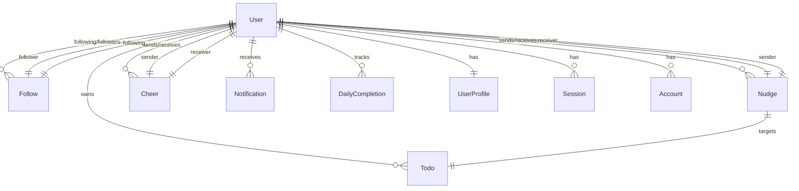

# Aido API 기능 문서

> 친구들과 함께하는 소셜 투두 앱 - 기능 중심 참조 문서

---

## 목차

1. [🎯 서비스 개요](#-서비스-개요)
2. [🗺️ 핵심 기능 맵](#️-핵심-기능-맵)
3. [📡 API 엔드포인트 요약](#-api-엔드포인트-요약)
4. [📋 비즈니스 규칙](#-비즈니스-규칙)
5. [🗄️ 데이터 모델 핵심 관계](#️-데이터-모델-핵심-관계)
6. [⚡ 이벤트 기반 아키텍처](#-이벤트-기반-아키텍처)
7. [🔌 외부 서비스 통합](#-외부-서비스-통합)
8. [🏗️ 기술 아키텍처 패턴](#️-기술-아키텍처-패턴)
9. [⚠️ 주요 제약사항 및 한계](#️-주요-제약사항-및-한계)
10. [📚 참고 문서](#-참고-문서)

---

## 🎯 서비스 개요

**Aido**는 친구들과 함께 할 일을 완료하고 서로 응원하는 소셜 투두 앱입니다.

### 핵심 가치 제안

1. **AI 기반 자연어 투두 파싱**
   - "내일 오후 3시에 팀 미팅" → 구조화된 투두 데이터로 자동 변환
   - Google Gemini 2.0 Flash 모델 활용

2. **친구와 함께하는 투두 완료**
   - 친구의 공개 투두 확인
   - 응원 보내기 (할 일 완료 축하)
   - 콕 찌르기 (할 일 독촉)

3. **일일/주간 완료 추적 및 달성 배지**
   - 일일 100% 완료 시 물고기 표시
   - 주간 완료율 추적
   - 캘린더 기반 시각화

### 주요 사용자

- **할 일 관리가 필요한 사용자**: 개인 투두 관리
- **친구와 함께 동기부여 받고 싶은 사용자**: 소셜 기능 활용

### 기술 스택

| 카테고리 | 기술 |
|----------|------|
| Framework | NestJS 11 |
| ORM | Prisma 7 |
| Database | PostgreSQL 16 |
| AI | Google Gemini 2.0 Flash |
| Push Notification | Expo Push Notification |
| Email | Resend |
| Authentication | JWT (Access 15분 + Refresh 7일) |

---

## 🗺️ 핵심 기능 맵

### 🔐 인증/계정
- 회원가입 (이메일 + 비밀번호)
- 이메일 인증 (6자리 코드)
- 소셜 로그인 (Apple, Google, Kakao, Naver)
- 비밀번호 관리 (변경, 재설정)
- 프로필 관리 (이름, 프로필 이미지)
- userTag 시스템 (8자리 영숫자, 예: "ABC12DEF")

### ✅ 투두 관리
- CRUD (생성, 조회, 수정, 삭제)
- 색상/날짜/시간 설정
- 공개 범위 (PUBLIC/PRIVATE)
- 친구 투두 조회 (PUBLIC만)
- 완료 상태 토글
- 일일 완료 추적

### 👥 친구/소셜
- userTag 기반 친구 요청
- 맞팔 관계 관리 (PENDING → ACCEPTED)
- 자동 수락 (상호 요청 시)
- 친구 목록 조회
- 친구 요청 목록 (받은/보낸)
- 친구 삭제/요청 철회

### 💬 상호작용
- **응원하기**: 친구에게 응원 메시지 전송
- **콕 찌르기**: 특정 할 일 독촉
- 읽음 처리
- 제한 및 쿨다운 확인

### 🤖 AI 파싱
- 자연어 → 구조화된 투두 데이터
- 스마트 시간 해석 (AM/PM 자동 판단)
- 날짜 표현 처리 (내일, 모레, 다음주 등)
- 사용량 추적 (FREE: 5회/일)

### 📊 통계/달성
- 일일 완료 현황 (날짜 범위 조회)
- 물고기 표시 (100% 완료일)
- 완료율 계산
- 주간 달성 배지 (WeeklyAchievement)

### 🔔 알림
- 푸시 알림 (Expo)
- 인앱 알림 목록
- 읽음 처리 (단일/전체)
- 야간 알림 필터링 (21:00-08:00)
- 알림 타입별 라우팅

---

## 📡 API 엔드포인트 요약

### Auth (`/auth`)

| Method | Endpoint | 설명 | 인증 | 제한사항 |
|--------|----------|------|------|---------|
| POST | `/auth/register` | 회원가입 | ❌ | 이메일 중복 불가 |
| POST | `/auth/verify-email` | 이메일 인증 | ❌ | 6자리 코드, 5회 시도 |
| POST | `/auth/resend-verification` | 인증 코드 재발송 | ❌ | 15분 유효 |
| POST | `/auth/login` | 로그인 | ❌ | 15분 내 5회 실패 시 계정 잠금 |
| POST | `/auth/refresh` | 토큰 갱신 | ❌ | Refresh Token 필요 |
| POST | `/auth/logout` | 로그아웃 | ✅ | 세션 삭제 |
| POST | `/auth/logout-all` | 모든 기기 로그아웃 | ✅ | 전체 세션 삭제 |
| GET | `/auth/me` | 내 정보 조회 | ✅ | - |
| PATCH | `/auth/profile` | 프로필 수정 | ✅ | - |
| POST | `/auth/password/change` | 비밀번호 변경 | ✅ | 기존 비밀번호 필요 |
| POST | `/auth/password/reset-request` | 비밀번호 재설정 요청 | ❌ | 이메일로 코드 발송 |
| POST | `/auth/password/reset` | 비밀번호 재설정 | ❌ | 6자리 코드 필요 |
| GET | `/auth/oauth/:provider/authorize` | OAuth 시작 | ❌ | Apple/Google/Kakao/Naver |
| GET | `/auth/oauth/:provider/callback` | OAuth 콜백 | ❌ | - |
| POST | `/auth/oauth/exchange` | OAuth 토큰 교환 | ❌ | - |

### Todo (`/todos`)

| Method | Endpoint | 설명 | 인증 | 제한사항 |
|--------|----------|------|------|---------|
| POST | `/todos` | 할 일 생성 | ✅ | title 200자, content 5000자 |
| GET | `/todos` | 할 일 목록 조회 | ✅ | 페이지네이션 (cursor) |
| GET | `/todos/:id` | 할 일 상세 조회 | ✅ | 본인 소유만 |
| GET | `/todos/friends/:userId` | 친구 투두 조회 | ✅ | PUBLIC만, 맞팔 필수 |
| PATCH | `/todos/:id` | 할 일 수정 | ✅ | 부분 수정 가능 |
| PATCH | `/todos/:id/complete` | 완료 상태 토글 | ✅ | - |
| PATCH | `/todos/:id/visibility` | 공개 범위 변경 | ✅ | PUBLIC/PRIVATE |
| PATCH | `/todos/:id/color` | 색상 변경 | ✅ | HEX 형식 (#RRGGBB) |
| PATCH | `/todos/:id/schedule` | 일정 변경 | ✅ | - |
| PATCH | `/todos/:id/content` | 제목/내용 수정 | ✅ | - |
| DELETE | `/todos/:id` | 할 일 삭제 | ✅ | 복구 불가 |

### Follow (`/follows`)

| Method | Endpoint | 설명 | 인증 | 제한사항 |
|--------|----------|------|------|---------|
| POST | `/follows/:userTag` | 친구 요청 보내기 | ✅ | userTag 8자리 |
| PATCH | `/follows/:userId/accept` | 친구 요청 수락 | ✅ | - |
| PATCH | `/follows/:userId/reject` | 친구 요청 거절 | ✅ | - |
| DELETE | `/follows/:userId` | 친구 삭제/요청 철회 | ✅ | - |
| GET | `/follows/friends` | 친구 목록 | ✅ | 페이지네이션 |
| GET | `/follows/requests/received` | 받은 친구 요청 | ✅ | 페이지네이션 |
| GET | `/follows/requests/sent` | 보낸 친구 요청 | ✅ | 페이지네이션 |

### Cheer (`/cheers`)

| Method | Endpoint | 설명 | 인증 | 제한사항 |
|--------|----------|------|------|---------|
| POST | `/cheers` | 응원 보내기 | ✅ | FREE 3회/일, 24시간 쿨다운 |
| GET | `/cheers/received` | 받은 응원 목록 | ✅ | 페이지네이션 |
| GET | `/cheers/sent` | 보낸 응원 목록 | ✅ | 페이지네이션 |
| GET | `/cheers/limit` | 일일 제한 정보 | ✅ | - |
| GET | `/cheers/cooldown/:userId` | 쿨다운 상태 조회 | ✅ | - |
| PATCH | `/cheers/:id/read` | 응원 읽음 처리 | ✅ | - |
| PATCH | `/cheers/read` | 여러 응원 읽음 처리 | ✅ | - |

### Nudge (`/nudges`)

| Method | Endpoint | 설명 | 인증 | 제한사항 |
|--------|----------|------|------|---------|
| POST | `/nudges` | 콕 찌르기 | ✅ | FREE 3회/일, 24시간 쿨다운 |
| GET | `/nudges/received` | 받은 콕 목록 | ✅ | 페이지네이션 |
| GET | `/nudges/sent` | 보낸 콕 목록 | ✅ | 페이지네이션 |
| GET | `/nudges/limit` | 일일 제한 정보 | ✅ | - |
| GET | `/nudges/cooldown/:userId` | 쿨다운 상태 조회 | ✅ | - |
| PATCH | `/nudges/:id/read` | 콕 읽음 처리 | ✅ | - |

### Notification (`/notifications`)

| Method | Endpoint | 설명 | 인증 | 제한사항 |
|--------|----------|------|------|---------|
| POST | `/notifications/token` | 푸시 토큰 등록 | ✅ | Expo 토큰 |
| DELETE | `/notifications/token` | 푸시 토큰 해제 | ✅ | - |
| GET | `/notifications` | 알림 목록 조회 | ✅ | 페이지네이션 |
| GET | `/notifications/unread-count` | 미읽음 알림 수 | ✅ | - |
| PATCH | `/notifications/:id/read` | 알림 읽음 처리 | ✅ | - |
| PATCH | `/notifications/read-all` | 전체 읽음 처리 | ✅ | - |

### AI (`/ai`)

| Method | Endpoint | 설명 | 인증 | 제한사항 |
|--------|----------|------|------|---------|
| POST | `/ai/parse-todo` | 자연어 파싱 | ✅ | FREE 5회/일, text 500자 |
| GET | `/ai/usage` | 사용량 조회 | ✅ | - |

### DailyCompletion (`/daily-completions`)

| Method | Endpoint | 설명 | 인증 | 제한사항 |
|--------|----------|------|------|---------|
| GET | `/daily-completions` | 날짜 범위 완료 현황 | ✅ | startDate~endDate 필수 |

**Swagger 문서**: `http://localhost:8080/api/docs`

---

## 📋 비즈니스 규칙

### 4.1 구독 단계별 제한

| 기능 | FREE | ACTIVE |
|------|------|--------|
| AI 파싱 | 5회/일 | 무제한 |
| 콕 찌르기 | 3회/일 | 무제한 |
| 응원하기 | 3회/일 | 무제한 |

- **리셋 시각**: KST 자정 (00:00)
- **구독 상태**: FREE, ACTIVE, EXPIRED, CANCELLED

### 4.2 쿨다운 정책

- **콕 찌르기**: 동일 할 일에 24시간 쿨다운
- **응원하기**: 동일 사용자에게 24시간 쿨다운
- 쿨다운 조회 API 제공 (남은 시간 확인 가능)

### 4.3 보안 정책

#### 로그인 시도
- 15분 내 5회 실패 시 계정 잠금 (LOCKED 상태)
- LoginAttempt 테이블에 기록

#### 이메일 인증
- 6자리 코드
- 최대 5회 시도
- 15분 유효

#### 비밀번호 재설정
- 6자리 코드
- 15분 유효
- 최대 5회 시도

#### 세션 관리
- **Access Token**: 15분 유효
- **Refresh Token**: 7일 유효
- **Token Rotation**: 재사용 감지 시 전체 토큰 패밀리 폐기
- Session 테이블에 refreshTokenHash, tokenFamily 관리

#### Rate Limiting
- 전역 100 req/min (Throttler)

### 4.4 친구 요청 로직

#### 상태 전이
```
없음 → PENDING → ACCEPTED
```

#### 자동 수락
- A→B 요청 중, B→A 요청하면 자동으로 친구 관계 성립 (양방향 ACCEPTED)

#### userTag
- 8자리 영숫자 (예: "ABC12DEF")
- 해시태그처럼 검색 가능
- 고유값 (중복 불가)

#### 맞팔 관계
- 양방향 ACCEPTED = 친구
- 한쪽만 ACCEPTED = 친구 아님

### 4.5 Todo 공개 범위

- **PUBLIC**: 친구만 조회 가능 (맞팔 관계 필수)
- **PRIVATE**: 나만 조회 가능

### 4.6 알림 필터링

- `pushEnabled`: 전체 푸시 ON/OFF
- `nightPushEnabled`: 야간(21:00-08:00 KST) 푸시 동의
- `marketingAgreedAt`: 마케팅 알림 동의 시각

---

## 🗄️ 데이터 모델 핵심 관계

### Mermaid ERD (핵심 엔티티)



### 주요 엔티티 설명

| 엔티티 | 설명 | 핵심 필드 |
|--------|------|-----------|
| User | 사용자 기본 정보 | id, email, userTag, status, subscriptionStatus |
| UserProfile | 사용자 프로필 (1:1) | name, profileImage |
| UserPreference | 사용자 설정 (1:1) | pushEnabled, nightPushEnabled |
| UserConsent | 약관 동의 (1:1) | termsAgreedAt, privacyAgreedAt, marketingAgreedAt |
| Todo | 할 일 | title, content, color, startDate, endDate, visibility, completed |
| Follow | 친구 관계 | followerId, followingId, status (PENDING/ACCEPTED) |
| Nudge | 콕 찌르기 | senderId, receiverId, todoId, message, readAt |
| Cheer | 응원 | senderId, receiverId, message, readAt |
| Notification | 알림 | userId, type, title, body, route, isRead |
| DailyCompletion | 일일 완료 | userId, date, totalTodos, completedTodos, achievedAt |
| Session | 세션 | userId, refreshTokenHash, tokenFamily, expiresAt |
| Account | 인증 계정 | userId, provider (CREDENTIAL/KAKAO/APPLE/GOOGLE/NAVER), password |
| PushToken | 푸시 토큰 | userId, token, deviceId, platform (IOS/ANDROID) |
| WeeklyAchievement | 주간 달성 | userId, year, week, totalTodos, completedTodos |
| Subscription | 구독 | userId, revenueCatId, productId, status, expiresAt |

---

## ⚡ 이벤트 기반 아키텍처

**EventEmitter2 활용 이벤트**:

| 이벤트 | 발생 시점 | 처리 동작 |
|--------|----------|----------|
| `todo.completed` | 할 일 완료 토글 | 일일 완료 집계 업데이트, 친구들에게 알림 전송 |
| `todo.all_completed` | 하루 할 일 모두 완료 | 본인에게 "오늘 할 일 완료" 알림 |
| `follow.accepted` | 친구 요청 수락 | 양방향 친구 관계 성립 알림 |
| `nudge.created` | 콕 찌르기 전송 | 받는 사람에게 푸시 알림 |
| `cheer.created` | 응원 전송 | 받는 사람에게 푸시 알림 |

**패턴**: 느슨한 결합 (Loose Coupling) - 서비스 간 직접 호출 대신 이벤트로 통신

---

## 🔌 외부 서비스 통합

| 서비스 | 용도 | 환경 변수 | 제한사항 |
|--------|------|-----------|---------|
| Google Gemini 2.0 Flash | AI 자연어 파싱 | `GOOGLE_GENERATIVE_AI_API_KEY` | FREE: 5회/일 |
| Expo Push Notification | 모바일 푸시 알림 | - | iOS/Android 토큰 관리 |
| Resend | 이메일 전송 | `RESEND_API_KEY` | 이메일 인증, 비밀번호 재설정 |
| Apple OAuth | 소셜 로그인 | `APPLE_CLIENT_ID`, `APPLE_TEAM_ID`, `APPLE_KEY_ID` | 신뢰된 제공자 |
| Google OAuth | 소셜 로그인 | `GOOGLE_CLIENT_ID`, `GOOGLE_CLIENT_SECRET` | 신뢰된 제공자 |
| Kakao OAuth | 소셜 로그인 | `KAKAO_CLIENT_ID`, `KAKAO_CLIENT_SECRET` | - |
| Naver OAuth | 소셜 로그인 | `NAVER_CLIENT_ID`, `NAVER_CLIENT_SECRET` | - |

### OAuth 이메일 충돌 처리

- **신뢰된 제공자 (Apple/Google)** + 이메일 검증됨 → 자동 연동
- **신뢰되지 않은 제공자 (Kakao/Naver)** 또는 이메일 미검증 → 강제 연동 필요

---

## 🏗️ 기술 아키텍처 패턴

### 모듈 구조

```
Controller (요청/응답)
    ↓
Service (비즈니스 로직)
    ↓
Repository (데이터 액세스)
```

### 주요 패턴

- **인증**: JWT (Access 15분 + Refresh 7일), Token Rotation
- **페이지네이션**: 커서 기반 (CUID/숫자), `hasMore`, `nextCursor`
- **유효성 검증**: Zod 스키마 (`@aido/validators`)
- **에러 처리**: 중앙화된 Exception Filter, 표준화된 에러 코드
- **로깅**: Pino 구조화 로깅 (개발: pretty, 프로덕션: JSON)
- **테스트**: Jest + Testcontainers (통합 테스트)
- **캐싱**: In-memory LRU cache (세션, 프로필, 친구 관계, 일일 통계)

### 공통 모듈

| 모듈 | 설명 |
|------|------|
| `DatabaseModule` | Prisma Client 관리 |
| `CacheModule` | 캐시 관리 (세션, 프로필, 통계) |
| `LoggerModule` | 구조화 로깅 |
| `ExceptionModule` | 전역 예외 필터 |
| `ResponseModule` | 응답 표준화 인터셉터 |
| `PaginationModule` | 커서/오프셋 페이지네이션 유틸 |
| `ThrottlerModule` | Rate Limiting (100 req/min) |
| `EventEmitterModule` | 이벤트 기반 아키텍처 |

---

## ⚠️ 주요 제약사항 및 한계

### 사용량 제한

- **Rate Limiting**: 전역 100 req/min (Throttler Guard)
- **AI 파싱**: FREE 5회/일, ACTIVE 무제한
- **콕 찌르기**: FREE 3회/일, ACTIVE 무제한, 24시간 쿨다운
- **응원하기**: FREE 3회/일, ACTIVE 무제한, 24시간 쿨다운

### 필드 제한

| 필드 | 제한 |
|------|------|
| userTag | 8자리 영숫자, 고유값 |
| Todo.title | 200자 제한 |
| Todo.content | 5000자 제한 |
| Nudge.message | 200자 제한 |
| Cheer.message | 200자 제한 |
| Notification.body | 500자 제한 |
| AI 파싱 text | 500자 제한 |

### 보안 제약

- **로그인 시도**: 15분 내 5회 실패 시 계정 잠금
- **이메일 인증**: 최대 5회 시도, 15분 유효
- **세션**: Refresh Token 7일 유효, 재사용 감지 시 전체 폐기

### 데이터 보관

- **알림**: 90일 자동 정리
- **세션**: 만료 후 자동 정리
- **Soft Delete**: User 삭제 시 `deletedAt` 설정, 실제 데이터 보존

---

## 📚 참고 문서

- **Swagger API 문서**: `http://localhost:8080/api/docs`
- **기술 스택 및 실행 방법**: `README.md`
- **아키텍처 상세**: `.claude/architecture.md`
- **테스트 가이드**: `.claude/unit-test.md`, `.claude/e2e-test.md`
- **Prisma 스키마**: `prisma/schema.prisma`
- **환경 변수 예시**: `.env.example`

---

**문서 버전**: 1.0.0
**최종 수정일**: 2026-01-26
**작성자**: Aido Team
