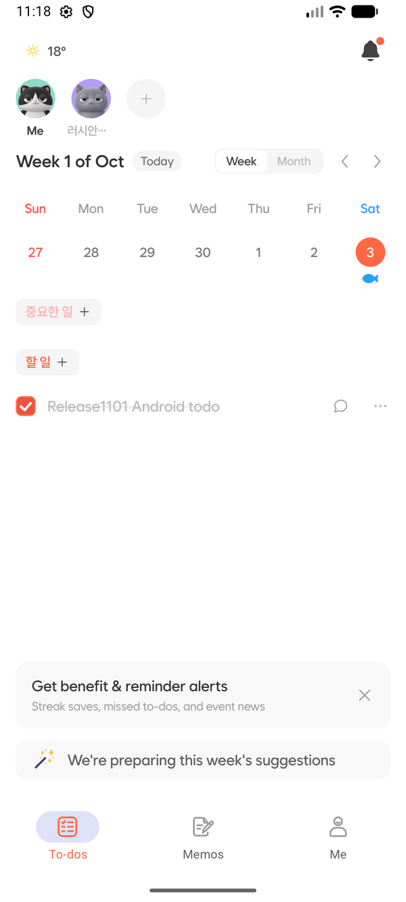
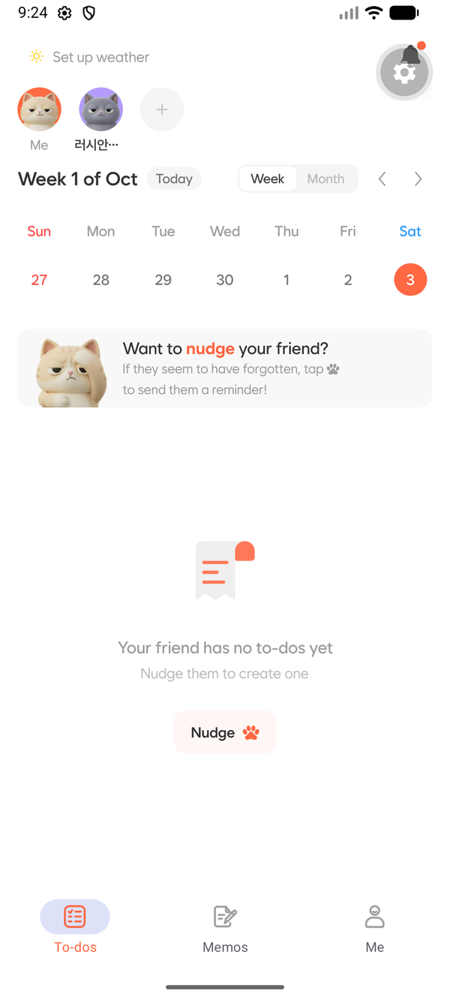
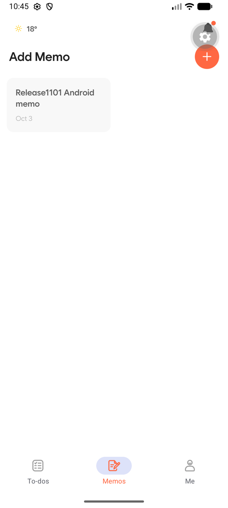
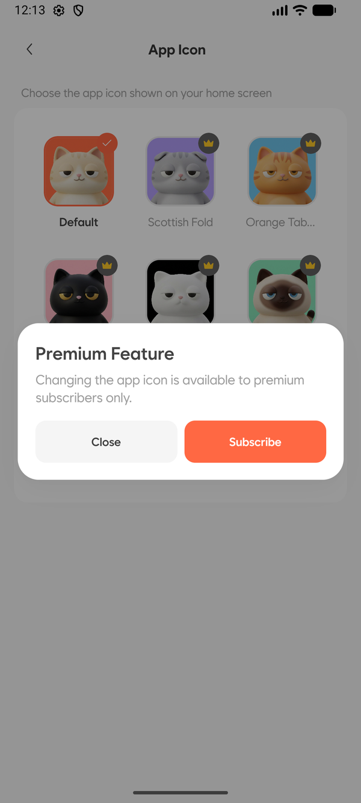
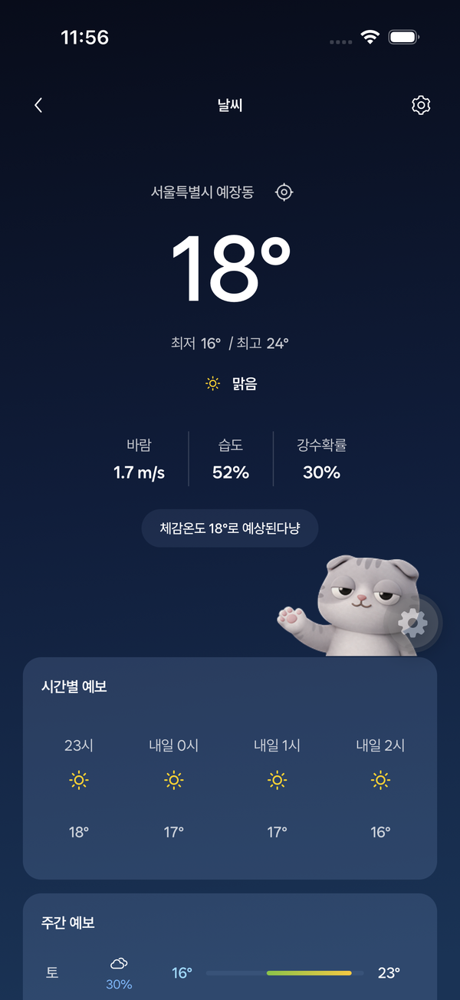
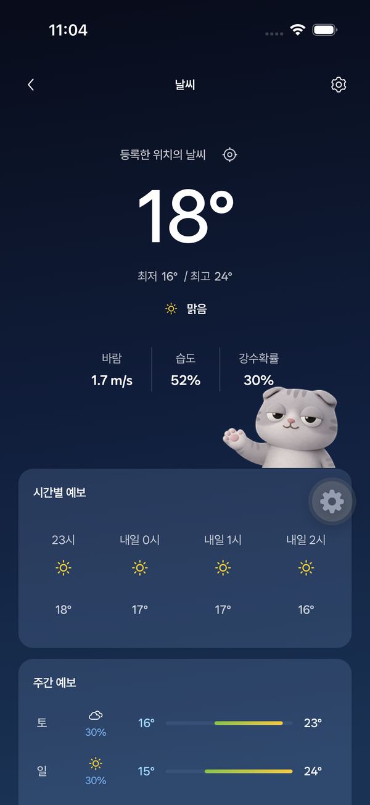
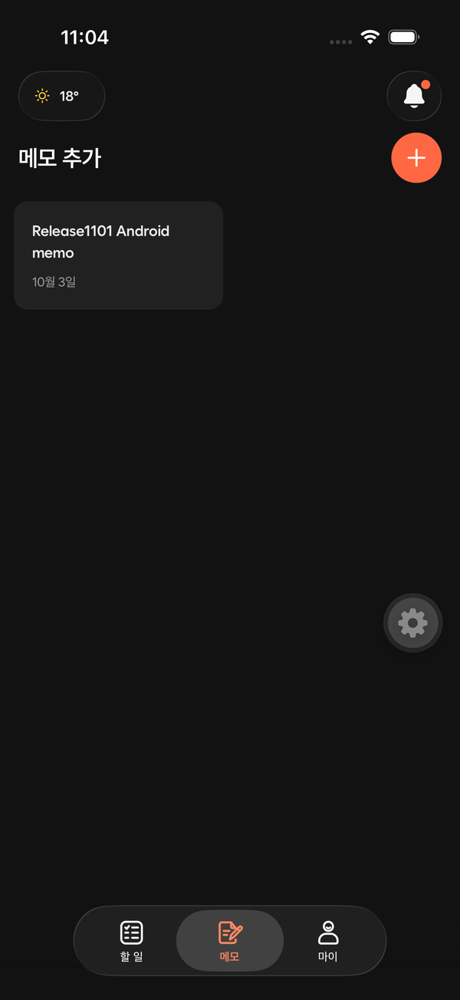
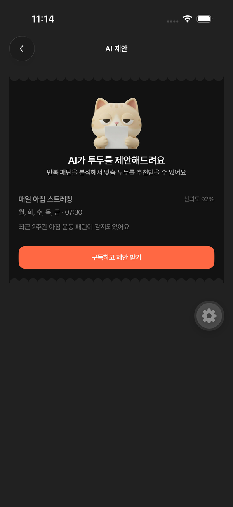
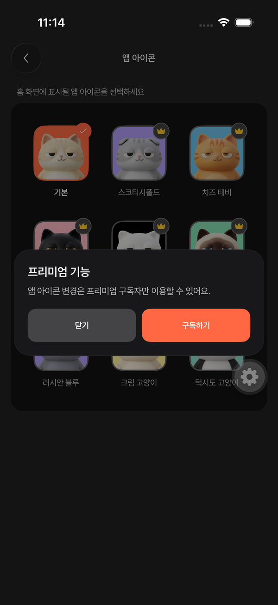
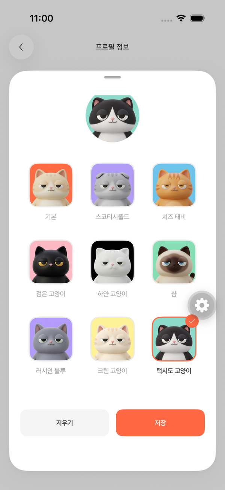

# 1.10.1 native QA

검증 기준: develop의 1.10.0 소스와 이 스택의 1.10.1 구현. Docker 개발 API와 별도 PostgreSQL을 사용하고 두 임시 계정에 FREE / ACTIVE 구독 상태를 구성했다. 운영 계정이나 실제 결제는 변경하지 않았다. 로그인 이메일·비밀번호·토큰·빌드 인증 로그는 공개 저장소에 포함하지 않는다.

## 환경

| 항목    | 환경                                                             |
| ------- | ---------------------------------------------------------------- |
| iOS     | iPhone 17 Pro Simulator / iOS 26.5 / Xcode 27.0 / 한국어         |
| Android | Medium Phone Emulator / Android API 36.1 / 영어                  |
| 앱      | 1.10.1, Expo SDK 58, RN Fabric, react-native-screens 4.28.0 원본 |
| 빌드    | iOS signed Debug Simulator, Android Debug 및 Release QA APK      |
| 자동화  | Maestro 2.11.0 / adb / simctl                                    |
| API     | 격리된 Docker 개발 서버, mock 이메일 OTP, 기존 서버 계약         |

## 실행 결과

| 시나리오                              | iOS                       | Android                                     | 확인 내용                                            |
| ------------------------------------- | ------------------------- | ------------------------------------------- | ---------------------------------------------------- |
| 이메일 로그인 / 홈                    | 통과, FREE·PAID           | 통과, PAID                                  | 최초 선택적 날씨 흐름이 인증과 홈을 막지 않음        |
| 날씨 진입·뒤로가기 10회               | 통과                      | 통과                                        | 기존 non-stack container 로그 재현 경로              |
| 위치 권한 거절 / 국내 지원 범위       | 해외 안내 통과            | 최초 설명 취소 후 홈 유지 통과              | 도쿄 위치에서 국내 날씨를 잘못 표시하지 않음         |
| 무료 AI / 앱 아이콘 권한              | 통과                      | 서버 계약 검증                              | 예시 및 구독 안내, AI_1309 일반 실패로 노출하지 않음 |
| 유료 AI / 앱 아이콘                   | 통과                      | 통과                                        | AI 준비 중 Empty와 신규 아이콘 변경                  |
| 러시안 블루 / 크림 / 턱시도 앱 아이콘 | OS 변경 확인 후 기본 복원 | alias 활성화 및 Release 재시작 후 기본 복원 | Android SDK의 런처 재시작 안내 유지                  |
| 프로필 9종 / 시트 저장                | 통과                      | 새 프로필 서버 반영·홈 표시 통과            | 마지막 행을 스크롤해 저장, 자식 컨트롤 접근성        |
| 친구 할 일 Empty                      | 화면 확인                 | 통과                                        | 남은 공간 중앙 정렬                                  |
| 할 일 작성·완료                       | 같은 데이터 표시 확인     | 통과                                        | 실제 생성·완료 API 및 홈 반영                        |
| 메모 작성·저장·목록                   | 같은 데이터 표시 확인     | 통과                                        | 저장 후 복귀 및 새 메모 표시                         |
| 다크 모드 / 세 탭                     | 통과                      | 다크/라이트 설정 복귀 3회 통과              | 세 탭의 형태 및 색상, 탭 최소화하지 않음             |
| 홈 마지막 AI 카드                     | 통과                      | 화면 확인                                   | 세로 automatic inset과 올바른 route 진입             |
| 1.10.0 / 1.10.1 프로필 HTTP           | 공유 서버 테스트 통과     | 공유 서버 테스트 통과                       | 구버전 fallback, 새 버전 새 키, 원본 DB 값 보존      |

Android 테마 변경 직후 설정 복귀에서 추가 native toolbar 오류를 확보했다. 기존 공용 ScreenTitleBar를 Expo Router custom header에 연결하고 나머지 12개 layout의 제목/액션을 재사용한다. Kotlin/Swift와 screens SDK 소스는 수정하지 않는다. Android Release에서 다크/라이트 설정 복귀, 메모와 날씨 이동을 3회 반복했고 해당 native 오류 로그는 0건이다. iOS는 공용 헤더 적용 후 테마 변경/복귀, 메모/할 일 탭, 날씨 진입/복귀를 다시 통과했다.

Android의 자동 위치 watch에는 `mayShowUserSettingsDialog: false`를 명시한다. GPS 설정이 꺼진 경우에도 자동 갱신이 Google의 위치 정확도 설정 창을 반복해서 열지 않는다. 위치를 구하지 못하면 제한 시간/정리 경로를 거쳐 가까운 UI에서 처리한다.

Android Release의 FREE 계정에서도 로그아웃/로그인, AI 예시 화면, 새 아이콘의 프리미엄 안내를 확인했고 해당 native 오류 로그는 0건이었다.

## 코드 검사

- 모바일 전체: 166 suites / 1,369 tests 통과.
- Root lint / format / typecheck와 모바일 conventions는 최종 커밋 및 CI에서 확인한다.
- 신규 순수 함수 및 Service 테스트는 한국어 Given / When / Then을 사용한다.
- 서버 프로필 호환 Docker E2E 3개, OpenAPI 계약 4개, 실제 구버전/새버전 HTTP 응답 확인 통과.
- 앱 아이콘 Service와 프로필 로직 15개, Firebase 초기화 config guard 4개, 스택 CI 정책 9개 통과.

## 재현

[Maestro 흐름](../../../maestro/release-1.10.1/)은 상태를 명시한 시나리오다. 모든 파일을 순서 없이 한 번에 실행하는 suite가 아니다. 로그인에는 별도 Docker fixture 계정과 환경 변수를 주입한다. iOS 아이콘 변경은 PAID 계정으로 아이콘 화면에서 시작하며 OS 확인 대화상자를 포함한다. 해외 검증은 Simulator 위치를 도쿄로 설정한 뒤 실행한다. 완료 후 서울로 복원한다. Debug의 RevenueCat Test Store offering 오류는 개발 LogBox로 표시될 수 있어 자동화 시작 전에 닫는다. Release QA는 실제 플랫폼 SDK 키를 사용한다.

```bash
maestro --device <device-id> test \
  --env QA_EMAIL=<fixture-email> \
  --env QA_PASSWORD=<fixture-password> \
  --env QA_SCREENSHOT_PREFIX=qa \
  apps/mobile/maestro/release-1.10.1/login.yaml

maestro --device <device-id> test \
  apps/mobile/maestro/release-1.10.1/weather-navigation.yaml
```

## production 산출물 검사

두 플랫폼은 `production` profile과 production API를 사용해 로컬 EAS 빌드한다. 최종 AAB/IPA 파일은 바탕화면에 둔다. 실제 결과와 SHA-256, native build 번호, source commit은 릴리스 PR과 바탕화면 검증 자료에 기록한다.

```bash
eas build --local --platform android --profile production
eas build --local --platform ios --profile production
pnpm --filter @aido/mobile check:ipa-linkage /absolute/path/Aido-1.10.1-ios.ipa
```

필수 검사는 앱 버전/서명, 9개 native icon 등록, production API·플랫폼 RevenueCat key·Sentry DSN, 소스맵 업로드, Firebase가 React Native factory 이전 초기화되는 순서, IPA Expo framework 간 strong symbol 연결이다. 기존 1.10.0의 DYLD 시작 실패를 방지하는 `usePrecompiledModules: false`를 유지한다. IPA의 arm64 linkage 정적 검사와 Simulator 실행은 서로 다른 검증이다.

실제 App Store 결제·OAuth 제공자 로그인·실제 APNs/FCM 전달·모든 iOS 실기기 실행은 이번 자동화 환경에서 완료하지 않았다. 스토어 제출을 수행하지 않는다. 지원 앱 버전은 1.10.1이 스토어에 공개되기 전 올리지 않는다.

## 화면 증거

임시 계정의 합성 데이터만 포함한다. 우측 톱니 모양의 Debug 도구는 production UI에 포함되지 않는다.

| 화면                               | 증거                                           |
| ---------------------------------- | ---------------------------------------------- |
| Android Release 홈과 구분된 세 탭  |  |
| 친구 Empty 중앙 정렬               |       |
| 메모 저장과 목록 복귀              |           |
| Android FREE 신규 아이콘 권한 안내 |        |
| iOS 라이트 공용 헤더 적용 후 날씨  |         |
| iOS 다크 날씨 헤더/본문            |                 |
| iOS 다크 메모 탭                   |                    |
| iOS 무료 AI 예시                   |                   |
| iOS 무료 아이콘 권한 안내          |             |
| iOS 프로필 9종과 저장              |             |
