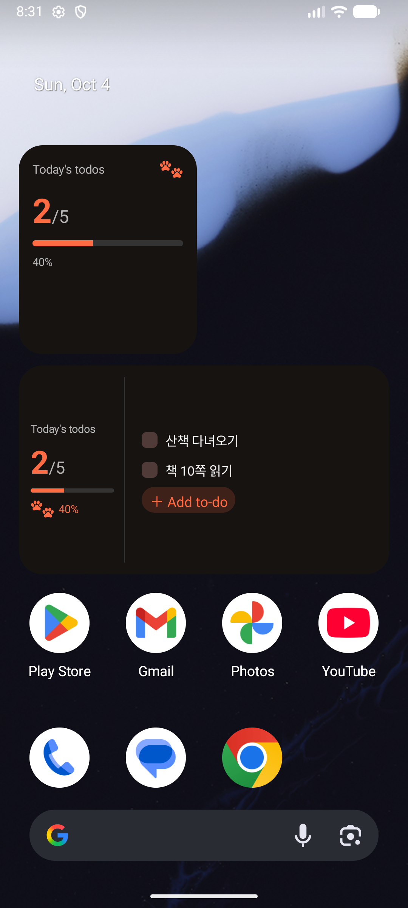
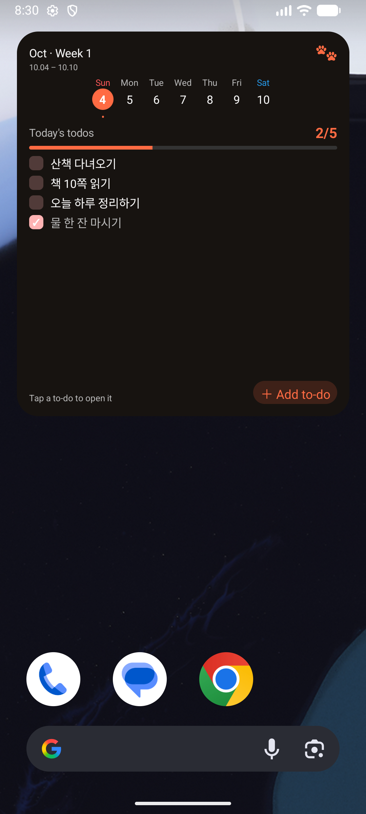
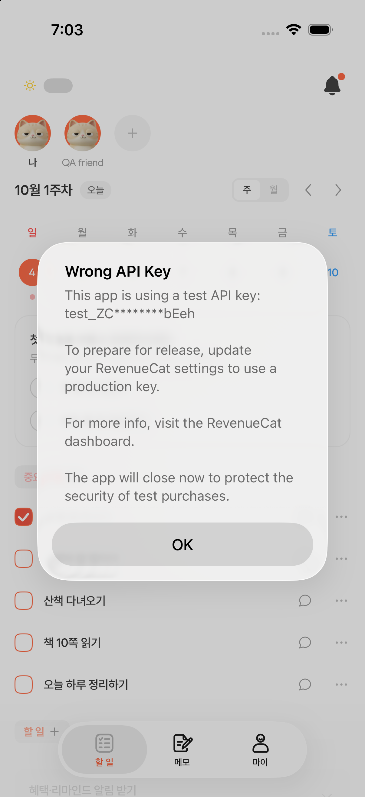
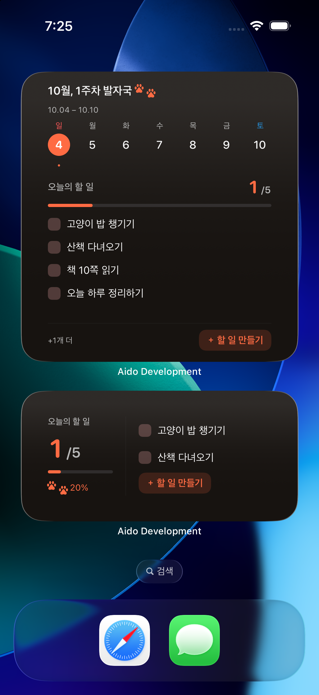

# 1.11.0 클라이언트: 구조·화면·native 검증

## 화면이 읽히는 순서

받은/보낸 찌르기 목록은 route에서 URL direction을 검증하고, 같은 feature query options를 소비한다. 목록은 `NudgeList`, 개별 항목은 `NudgeList.Item`, 주변 상태는 `NudgeList.Loading / Empty / Error`로 묶는다. 빈 화면은 남은 영역 중앙에 배치하고, 다음 페이지 오류는 목록 하단의 명시적인 재시도로 복구한다. 오류가 나도 이미 받은 항목을 지우지 않는다.

상세 페이지는 찌르기와 현재 사용자 query를 함께 읽고, 세 답장 버튼을 명시적으로 렌더링한다. 각 버튼의 문구와 동작을 화면에서 읽을 수 있다. 완료는 기존 할 일 화면으로 이동해 직접 한다. `NudgeThanksButton`은 원본 Button의 ComponentProps를 확장하고 관련 Sheet/Recipients/Loading/Error/Empty만 namespace에 둔다. feature 모델에는 화면 라벨을 넣지 않는다.

## Before / After 폴더 구조

```text
Before
app/(app)/(tabs)/feed/(feed)/_layout.tsx      layout에서 날짜 URL 구독
src/shared/providers/local-date-provider.tsx 주기적으로 날짜 확인
src/features/todo/models/todo.model.ts
src/features/todo/services/todo-nudge.service.ts 기존 전송 capability
src/features/widget/                        기존 진행률·목록

After
app/(app)/nudges/
  index.tsx / [nudgeId].tsx / _layout.tsx     라우트 전용 SearchSchema + 명시적 화면
app/(app)/(tabs)/feed/(feed)/
  index.tsx / friend/[friendId].tsx          leaf URL 상태 소유
src/bootstrap/
  providers/app-providers.tsx               공통 Provider 의존 순서
  navigation/auth-gate-layout.tsx           항상 마운트된 root Stack
  hooks/use-widget-app-entry.ts             최초 URL의 auth 복원 이후 진입
src/features/todo/
  models/nudge-interaction.model.ts          평탄한 클라이언트 Zod 모델·Policy
  services/nudge-interaction.mapper.ts       shared DTO → Date/domain
  services/todo-nudge.service.ts             기존 DI Service 확장
  presentations/
    components/nudge-interactions/
      NudgeList.tsx / NudgeThanksButton.tsx
    queries/                                query/infinite/mutation options
    providers/feed-date-provider.tsx         controlled date 컨텍스트
src/features/widget/
  models/                                   v1 snapshot + 선택적 새 필드
  services/                                 순수 snapshot/props mapper + 직렬 sync
  bridge/                                   기존 native bridge
  presentations/
    widgets.ios.tsx / widgets.android.tsx    isolated native UI
    navigation/resolve-widget-app-route.ts  허용된 초기 링크 검증
    hooks/use-widget-snapshot-sync.ts       기존 Query cache 구독
src/shared/
  providers/local-date-provider.tsx         전역 자정·foreground clock
  utils/local-date-clock.ts / date-format.ts 순수 Intl 날짜 키
  config/revenuecat-api-key.ts               debug/Release SDK key 선택
plugins/
  withWidgetAssets.js                       기존 paw SVG → Android drawable
```

## 상태 소유와 Provider

서버 상태는 TanStack Query에 둔다. URL 상태는 leaf route의 ExpoRouter `useLocalSearchParams`/`setParams`가 소유한다. 화면 필터·시트 상태는 React/공용 Overlay를 사용한다. Layout Provider 안에서 route search를 다시 구독하거나 같은 날짜를 URL과 Context 양쪽 state에 복제하지 않는다.

AppProviders는 Gesture/Keyboard → font/language/theme/HeroUI → Query → DI → LocalDate → Auth → RevenueCat/Notifications → BottomSheet/ErrorBoundary/Overlay 순서를 유지한다. LocalDateProvider는 한 번만 있고, CalendarProvider는 feed의 공통 layout, FeedDateProvider는 각 leaf에서 controlled 값으로 조립한다. 날씨는 기존 인증 영역 WeatherSessionProvider를 재사용한다.

새 찌르기 feature는 기존 TodoNudgeService를 확장하므로 전달 전용 별도 Service/Provider를 만들지 않는다. 서비스는 `unknown` HTTP 결과를 공유 validator로 검증한 뒤 UI가 사용하는 평탄한 모델로 변환한다. Type은 Zod infer이고 서버 Entity/Prisma 타입을 모바일에 import하지 않는다. Policy는 화살표 메서드로 소비하며 `this` bind에 의존하지 않는다.

## 날짜·자정·타임존

`Intl.DateTimeFormat`으로 날짜 키를 만들고 bounded formatter cache를 사용한다. 잘못된 Date는 빈 날짜 키로 분리한다. `date`가 없거나 `today`인 feed는 새 날짜를 따라가고, 사용자가 선택한 고정 날짜는 유지한다. 오늘 버튼은 URL date를 비워 오늘 모드로 복귀한다.

전역 clock은 다음 local midnight에 단일 timer를 예약한다. background에서는 timer를 지우고 foreground에서 날짜·timezone·UTC offset을 재평가한다. 23/25시간 DST 날과 같은 날짜 내 타임존 이동도 검증했다. OS 위젯 갱신 주기는 플랫폼 정책을 따르므로 정확한 자정의 native 갱신을 보장한다고 표현하지 않는다. iOS는 다음 자정 stale timeline, Android는 render 시 snapshot 날짜 판정으로 오래된 오늘 데이터를 그대로 표시하지 않는다.

## 위젯과 톤앤매너

작은 위젯은 완료 수/전체 수·진행률·연속 기록을 유지하고 발바닥 두 개만 밝은 brand 색으로 통일했다. 중간은 오늘 할 일 2개와 생성 버튼, 큰 위젯은 주간 달력·오늘 할 일 4개·생성 버튼이다. 완료하지 않은 할 일 우선, 작은 위젯의 0/1 디자인과 동일한 카운트를 사용한다.

iOS는 SF pawprint.fill 두 개, Android는 기존 공용 paw SVG로 만든 두 발자국 drawable을 사용한다. bitmap을 새로 생성하지 않는다. 라이트는 흰색, 다크는 따뜻한 #171310, brand는 #FF6B43이다. 일반 목록 데이터는 map으로 변환하되 의미가 다른 버튼/고정 주간 slot은 명시적인 호출로 구성한다.

기존 widget 이름, Android provider component, iOS bundle identifier/App Group, snapshot v1을 유지한다. 새 snapshot 필드는 optional이다. SDK 58.0.11의 공식 Glance active session/ReactHost 수정과 기존 compatibility patch를 적용한다. Android SDK 58 구현은 배포된 npm source를 기준으로 검증했다. public latest 문서의 다른 SDK 버전과 혼동하지 않는다.

할 일 row → 기존 `/todo/:todoId`, 날짜 → `/feed?date=...`, 생성 → `/feed?date=today&action=add-todo`이다. 생성은 기존 AddTodoBottomSheet를 재사용하고 category 요청의 loading/error/empty를 분리한다. Category가 없는 경우 설정 이동을 제공한다. URL action은 실제 sheet를 열 때 한 번 소비한다.

초기 widget URL은 허용한 scheme/path/date/id만 검증한다. 인증 복원이 끝나고 `(app)` 영역이 마운트된 뒤 한 번 다시 이동한다. Warm navigation을 별도 listener로 중복 처리하지 않는다. 링크 복원 실패가 앱 startup을 reject하지 않도록 오류를 보고한다.

## 실제 위젯 화면

| Android 소·중 (다크)                                              | Android 대 (다크)                                           |
| ----------------------------------------------------------------- | ----------------------------------------------------------- |
|  |  |

| iOS 소·중                                                    | iOS 중·대 (다크)                                                |
| ------------------------------------------------------------ | --------------------------------------------------------------- |
|  |  |

## Cleanup와 예외

- local midnight timer, AppState/language listener: unmount/background cleanup.
- initial URL Promise: unmount 뒤 state 변경 차단; 예정된 navigation RAF 취소.
- 생성 sheet RAF: cleanup; useOverlay의 소유자가 unmount되면 sheet 제거.
- NotificationProvider: auth/nav 준비 뒤 queue 처리, account 변경/logout 시 pending 제거, 처리 중 세션 재확인.
- ModalBottomSheet: Reanimated 값의 진행 animation 취소.
- WidgetSyncService: native write 직렬화 + generation으로 오래된 account snapshot이 logout을 덮지 않게 한다. 동일 snapshot 중복 쓰기를 생략하고 native/관측 실패를 startup에 전파하지 않는다.
- Query 요청은 기존 HttpClient의 AbortSignal 계약을 유지한다.
- RevenueCat test_ key는 debug 개발 빌드에서만 선택한다. Release는 플랫폼 key를 사용하고 test key를 잘못 등록한 경우 초기화를 생략한다. SDK의 강제 종료를 우회하지 않는다.

## 배포 파일과 제외 규칙

production EAS local build는 `APP_ENV=production`, production API, Release 설정으로 만든다. QA Release는 개발 Docker API를 사용한 별도 native 빌드다. 두 종류를 혼동하지 않는다. production Sentry upload를 끄거나 실패를 무시하는 환경은 사용하지 않는다. 플랫폼별 TMPDIR를 분리해 병렬 로컬 빌드의 Metro 캐시 충돌을 방지한다. 앱과 위젯 extension 버전은 EAS의 기본 갱신/내보내기를 재사용하고 최종 IPA의 두 Info.plist를 검증한다.

`.easignore`는 기존 gitignore와 credential 제외를 유지하고 app docs/maestro/native 생성 폴더를 제외한다. source/assets/plugins/patches는 포함한다. `.dockerignore`는 mobile 전체와 중첩 markdown/docs를 제외한다. 의존 패키지 자체의 라이선스/README는 node_modules 안에 남을 수 있다.

## Native QA와 한계

Docker 개발 서버에 서로 친구인 임시 FREE/ACTIVE 계정을 만들었다. 양 플랫폼 Release에서 로그인/계정 전환, received/sent 목록, 세 답장, 답장만으로 미완료 유지, 직접 완료 후 감사 preview/전송, 이미 보낸 감사, 존재하지 않는 id의 빈/오류 복구를 검증했다. 라이트/다크 피드와 고정 날짜 링크·오늘 버튼 복귀를 양 플랫폼에서 검증했다. Docker 개발 API를 잠시 중단해 양 플랫폼의 Suspense 오류 화면이 크래시 없이 재시도를 제공하고, API 복구 후 재시도가 404 빈 상태로 전환되는 것을 확인했다. 소/중/대 위젯을 실제 홈 화면에 등록했다. Android 기존 위젯이 Release 업데이트 후 재등록 없이 갱신되며, 양 플랫폼의 앱 종료 후 생성·할 일 상세 링크와 iOS 실제 위젯 생성 버튼을 검증했다.

실제 결제·스토어 영수증·실물 기기 push는 에뮬레이터의 ACTIVE fixture로 검증한 것으로 대체해 주장하지 않는다. QA 계정 비밀번호/token과 로그는 /tmp private 파일로 유지하고 repository에 넣지 않는다. 스토어 제출은 별도 단계다.

## 최종 production 파일

| 플랫폼  | 버전 / 빌드  | 파일                         |
| ------- | ------------ | ---------------------------- |
| Android | 1.11.0 / 69  | `Aido-1.11.0-production.aab` |
| iOS     | 1.11.0 / 123 | `Aido-1.11.0-production.ipa` |

두 파일의 embedded Expo config는 `production`, `https://api.aido.kr`, `isDevelopment: false`다. iOS 앱/extension 모두 1.11.0(123)이며 IPA native Expo 심볼 203개 검사가 통과했다. Sentry source map·iOS debug symbol 업로드 성공을 로그에서 확인했다. iOS codesign 검증이 통과했고 Android InputMerger 생성자의 keep 규칙을 최종 R8 configuration에서 확인했다. 추가 UI·BottomSheet 수정을 포함한 파일로 기존 68/122 빌드를 교체했고 이전 파일은 로컬에 백업했다.

- AAB SHA-256: `2b323a6e6d253beeeff5c0447f9e90ec43d73125856d86e1478fa2ce10569384`
- IPA SHA-256: `d315b9da377e0c871f5072b2d041fc751552266faf68fd9316656290d7e96996`

## 스토어 패치노트

친구의 콕 찌르기에 답장을 보내고, 할 일을 마친 뒤 고마움을 전해 보세요. 홈 위젯에서 오늘의 할 일과 한 주의 발자국을 확인하고 바로 할 일을 만들 수 있어요. 작은 위젯의 발바닥을 더 잘 보이게 다듬고, 날짜가 바뀌거나 앱을 처음 열 때의 동작을 개선했어요.

## 실제 코드 Before / After

Before는 1.10.1 기준 `33f7e1d3`, After는 1.11.0 구현이다.

### `apps/mobile/src/features/todo/models/nudge-interaction.model.ts`

Before: 해당 파일 없음. 기존 feature의 책임 경계 안에 추가한 기능이다.

After:

```ts
import { getNudgeInteractionsQuerySchema, nudgeReplyKindSchema } from '@aido/validators';
import { z } from 'zod';

import type { TodoItem } from './todo.model';

export const nudgeDirectionSchema = getNudgeInteractionsQuerySchema.shape.direction;
export type NudgeDirection = z.infer<typeof nudgeDirectionSchema>;

export const nudgeInteractionSchema = z.object({
  id: z.number(),
  senderId: z.string(),
  senderName: z.string(),
  senderProfileImage: z.string().nullable(),
  receiverId: z.string(),
  receiverName: z.string(),
  receiverProfileImage: z.string().nullable(),
  todoId: z.number(),
  todoTitle: z.string().nullable(),
  isTodoCompleted: z.boolean(),
  message: z.string().nullable(),
  replyKind: nudgeReplyKindSchema.nullable(),
  thankedAt: z.date().nullable(),
  createdAt: z.date(),
  isAvailable: z.boolean(),
});
export type NudgeInteraction = z.infer<typeof nudgeInteractionSchema>;

export const nudgeInteractionPageSchema = z.object({
  items: z.array(nudgeInteractionSchema),
  nextCursor: z.number().nullable(),
  hasNext: z.boolean(),
});
export type NudgeInteractionPage = z.infer<typeof nudgeInteractionPageSchema>;

export const nudgeThanksPreviewSchema = z.object({
  todoId: z.number(),
  throughNudgeId: z.number().nullable(),
  recipients: z.array(
    z.object({
      id: z.string(),
      name: z.string(),
      profileImage: z.string().nullable(),
    }),
  ),
});
export type NudgeThanksPreview = z.infer<typeof nudgeThanksPreviewSchema>;

export const NudgeInteractionPolicy = {
  isThankableTodo: (
    todo: Pick<TodoItem, 'completed' | 'visibility'>,
    { isOwner }: { isOwner: boolean },
  ): boolean => isOwner && todo.completed && todo.visibility === 'PUBLIC',
  isReplyable: (
    nudge: Pick<NudgeInteraction, 'receiverId' | 'isAvailable'>,
    currentUserId: string,
  ): boolean => nudge.receiverId === currentUserId && nudge.isAvailable,
  isThankable: (preview: Pick<NudgeThanksPreview, 'throughNudgeId' | 'recipients'>): boolean =>
    preview.throughNudgeId !== null && preview.recipients.length > 0,
};
```

### `apps/mobile/src/features/todo/services/nudge-interaction.mapper.ts`

Before: 해당 파일 없음. 기존 feature의 책임 경계 안에 추가한 기능이다.

After:

```ts
import type {
  NudgeInteractionResponse,
  NudgeInteractionsResponse,
  NudgeThanksPreviewResponse,
} from '@aido/validators';

import type {
  NudgeInteraction,
  NudgeInteractionPage,
  NudgeThanksPreview,
} from '../models/nudge-interaction.model';

export const toNudgeInteraction = (dto: NudgeInteractionResponse): NudgeInteraction => ({
  id: dto.id,
  senderId: dto.sender.id,
  senderName: dto.sender.name ?? dto.sender.userTag,
  senderProfileImage: dto.sender.profileImage,
  receiverId: dto.receiver.id,
  receiverName: dto.receiver.name ?? dto.receiver.userTag,
  receiverProfileImage: dto.receiver.profileImage,
  todoId: dto.todoId,
  todoTitle: dto.todo?.title ?? null,
  isTodoCompleted: dto.todo?.completed ?? false,
  message: dto.message,
  replyKind: dto.replyKind,
  thankedAt: dto.thankedAt === null ? null : new Date(dto.thankedAt),
  createdAt: new Date(dto.createdAt),
  isAvailable: dto.isAvailable,
});

export const toNudgeInteractionPage = (dto: NudgeInteractionsResponse): NudgeInteractionPage => ({
  items: dto.items.map(toNudgeInteraction),
  nextCursor: dto.pagination.nextCursor,
  hasNext: dto.pagination.hasNext,
});

export const toNudgeThanksPreview = (dto: NudgeThanksPreviewResponse): NudgeThanksPreview => ({
  todoId: dto.todoId,
  throughNudgeId: dto.throughNudgeId,
  recipients: dto.recipients.map((recipient) => ({
    id: recipient.id,
    name: recipient.name ?? recipient.userTag,
    profileImage: recipient.profileImage,
  })),
});
```

### `apps/mobile/src/features/todo/presentations/components/nudge-interactions/NudgeList.tsx`

Before: 해당 파일 없음. 기존 feature의 책임 경계 안에 추가한 기능이다.

After:

```ts
import { ErrorCode } from '@aido/errors';
import { FlashList } from '@shopify/flash-list';
import { getProfileIconSource } from '@src/features/user/presentations/utils/profile-icon.util';
import { isApiError } from '@src/shared/errors';
import { useRefresh } from '@src/shared/hooks/useRefresh';
import { useTranslation } from '@src/shared/i18n';
import {
  Avatar,
  Box,
  Button,
  HStack,
  ListRow,
  PawIcon,
  Result,
  Text,
  VStack,
  type QueryErrorFallbackProps,
} from '@src/shared/ui';
import { formatRelativeTime } from '@src/shared/utils/date';
import { useSuspenseInfiniteQuery } from '@tanstack/react-query';
import { router } from 'expo-router';
import { PressableFeedback, Skeleton, Spinner } from 'heroui-native';
import { RefreshControl, ScrollView } from 'react-native';

import type { NudgeDirection, NudgeInteraction } from '../../../models/nudge-interaction.model';
import { useGetNudgeInteractionsInfiniteQueryOptions } from '../../queries/get-nudge-interactions-infinite-query-options';
import { getNudgeReplyLabelKey } from '../../utils/nudge-reply-label';

export function NudgeList({ direction }: { direction: NudgeDirection }) {
  const { t } = useTranslation('common');
  const query = useSuspenseInfiniteQuery(useGetNudgeInteractionsInfiniteQueryOptions(direction));
  const [isRefreshing, handleRefresh] = useRefresh(query.refetch);

  const refreshControl = <RefreshControl refreshing={isRefreshing} onRefresh={handleRefresh} />;

  if (query.data.length === 0) {
    return (
      <ScrollView
        className="flex-1"
        contentContainerStyle={{ flexGrow: 1 }}
        refreshControl={refreshControl}
      >
        <NudgeList.Empty />
      </ScrollView>
    );
  }

  return (
    <FlashList
      data={query.data}
      renderItem={({ item }) => <NudgeList.Item nudge={item} direction={direction} />}
      keyExtractor={(nudge) => String(nudge.id)}
      contentContainerStyle={{ flexGrow: 1, paddingBottom: 24 }}
      refreshControl={refreshControl}
      ListFooterComponent={
        query.isFetchNextPageError ? (
          <Box p={16}>
            <Button variant="weak" onPress={() => void query.fetchNextPage()}>
              {t('actions.retry')}
            </Button>
          </Box>
        ) : query.isFetchingNextPage ? (
          <Box py={16}>
            <Spinner />
          </Box>
        ) : null
      }
      onEndReached={() => {
        if (query.hasNextPage && !query.isFetching && !query.isFetchNextPageError) {
          void query.fetchNextPage({ cancelRefetch: false });
        }
      }}
      onEndReachedThreshold={0.5}
    />
  );
}

NudgeList.Item = function Item({
  nudge,
  direction,
}: {
  nudge: NudgeInteraction;
  direction: NudgeDirection;
}) {
  const { t } = useTranslation('todo');
  const name = direction === 'received' ? nudge.senderName : nudge.receiverName;
  const profileImage =
    direction === 'received' ? nudge.senderProfileImage : nudge.receiverProfileImage;
  const status = nudge.thankedAt
    ? t('interaction.thanked')
    : nudge.replyKind
      ? t('interaction.replyStatus', { reply: t(getNudgeReplyLabelKey(nudge.replyKind)) })
      : t('interaction.waiting');

  return (
    <PressableFeedback
      onPress={() => router.push({ pathname: '/nudges/[nudgeId]', params: { nudgeId: nudge.id } })}
    >
      <ListRow
        horizontalPadding="medium"
        verticalPadding="large"
        left={
          <Avatar alt={name} className="size-11">
            <Avatar.Image source={getProfileIconSource(profileImage)} />
          </Avatar>
        }
        contents={
          <VStack gap={6}>
            <HStack justify="between" align="center">
              <Text size="b4" shade={5}>
                {name}
              </Text>
              <Text size="e1" shade={5}>
                {formatRelativeTime(nudge.createdAt)}
              </Text>
            </HStack>
            <Text size="b3" weight="semibold" maxLines={2}>
              {nudge.todoTitle ?? t('interaction.unavailableTodo')}
            </Text>
            {nudge.message && (
              <Text size="b4" shade={6} maxLines={2}>
                {nudge.message}
              </Text>
            )}
            <Text
              size="e1"
              tone={nudge.isAvailable ? 'brand' : 'neutral'}
              shade={nudge.isAvailable ? undefined : 5}
            >
              {nudge.isAvailable ? status : t('interaction.unavailable')}
            </Text>
          </VStack>
        }
      />
    </PressableFeedback>
  );
};

NudgeList.Empty = function Empty() {
  const { t } = useTranslation('todo');
  return (
    <VStack flex={1} px={24} py={40}>
      <Result
        icon={<PawIcon width={64} height={64} colorClassName="text-main" />}
        title={t('interaction.emptyTitle')}
        description={t('interaction.emptyDescription')}
      />
    </VStack>
  );
};

NudgeList.Error = function ErrorState({ error, reset }: QueryErrorFallbackProps) {
  const { t } = useTranslation(['todo', 'common']);
  const isDisabled = isApiError(error) && error.hasCode(ErrorCode.NUDGE_1105);
  return (
    <VStack flex={1} px={24} py={32}>
      <Result
        title={t(isDisabled ? 'todo:interaction.disabledTitle' : 'todo:interaction.loadError')}
        description={isDisabled ? t('todo:interaction.disabledDescription') : undefined}
        button={<Result.Button onPress={reset}>{t('common:actions.retry')}</Result.Button>}
      />
    </VStack>
  );
};

NudgeList.Loading = function Loading() {
  return (
    <VStack p={24} gap={24} flex={1}>
      {Array.from({ length: 4 }, (_, index) => (
        <HStack key={index} gap={12}>
          <Skeleton className="size-11 rounded-full" />
          <VStack flex={1} gap={8}>
            <Skeleton className="w-24 h-4 rounded" />
            <Skeleton className="w-full h-5 rounded" />
            <Skeleton className="w-1/2 h-3 rounded" />
          </VStack>
        </HStack>
      ))}
    </VStack>
  );
};
```

### `apps/mobile/src/features/todo/presentations/components/nudge-interactions/NudgeThanksButton.tsx`

Before: 해당 파일 없음. 기존 feature의 책임 경계 안에 추가한 기능이다.

After:

```ts
import { ErrorCode } from '@aido/errors';
import { getProfileIconSource } from '@src/features/user/presentations/utils/profile-icon.util';
import { isApiError } from '@src/shared/errors';
import { useTranslation } from '@src/shared/i18n';
import {
  Avatar,
  Button,
  HStack,
  ModalBottomSheet,
  QueryErrorBoundary,
  Result,
  Text,
  VStack,
  useOverlay,
  type QueryErrorFallbackProps,
} from '@src/shared/ui';
import { useMutation, useQuery, useSuspenseQuery } from '@tanstack/react-query';
import { Skeleton } from 'heroui-native';
import { Suspense, type ComponentProps } from 'react';
import { ScrollView, useWindowDimensions } from 'react-native';

import { NudgeInteractionPolicy } from '../../../models/nudge-interaction.model';
import { useGetNudgeInteractionAvailabilityQueryOptions } from '../../queries/get-nudge-interaction-availability-query-options';
import { useGetNudgeThanksPreviewQueryOptions } from '../../queries/get-nudge-thanks-preview-query-options';
import { useSendNudgeThanksMutationOptions } from '../../queries/use-send-nudge-thanks-mutation-options';

type NudgeThanksButtonProps = Omit<ComponentProps<typeof Button>, 'children'> & { todoId: number };

export function NudgeThanksButton({ todoId, onPress, ...props }: NudgeThanksButtonProps) {
  const { t } = useTranslation('todo');
  const overlay = useOverlay();
  const availability = useQuery(useGetNudgeInteractionAvailabilityQueryOptions());
  if (!availability.data) return null;

  return (
    <Button
      {...props}
      variant={props.variant ?? 'weak'}
      color={props.color ?? 'primary'}
      onPress={(event) => {
        onPress?.(event);
        void overlay
          .open(({ isOpen, close, exit }) => (
            <NudgeThanksButton.Sheet
              todoId={todoId}
              isOpen={isOpen}
              onClose={close}
              onExit={exit}
            />
          ))
          .catch(() => undefined);
      }}
    >
      {t('interaction.thanksAction')}
    </Button>
  );
}

NudgeThanksButton.Sheet = function Sheet({
  todoId,
  ...props
}: Omit<ComponentProps<typeof ModalBottomSheet>, 'children'> & { todoId: number }) {
  const { t } = useTranslation('todo');
  return (
    <ModalBottomSheet {...props}>
      <VStack gap={16} pb={16}>
        <Text size="b2" weight="bold">
          {t('interaction.thanksTitle')}
        </Text>
        <QueryErrorBoundary
          resetKeys={[todoId]}
          fallback={(errorProps) => (
            <NudgeThanksButton.Error {...errorProps} onClose={props.onClose} />
          )}
        >
          <Suspense fallback={<NudgeThanksButton.Loading />}>
            <NudgeThanksButton.Recipients todoId={todoId} onSent={props.onClose} />
          </Suspense>
        </QueryErrorBoundary>
      </VStack>
    </ModalBottomSheet>
  );
};

NudgeThanksButton.Recipients = function Recipients({
  todoId,
  onSent,
}: {
  todoId: number;
  onSent: () => void;
}) {
  const { t } = useTranslation('todo');
  const { height } = useWindowDimensions();
  const { data: preview } = useSuspenseQuery(useGetNudgeThanksPreviewQueryOptions(todoId));
  const mutation = useMutation(useSendNudgeThanksMutationOptions());

  if (!NudgeInteractionPolicy.isThankable(preview)) return <NudgeThanksButton.Empty />;

  return (
    <VStack gap={16}>
      <Text size="b3" shade={6}>
        {t('interaction.thanksDescription', { count: preview.recipients.length })}
      </Text>
      <ScrollView style={{ maxHeight: height * 0.3 }}>
        <VStack gap={12}>
          {preview.recipients.map((recipient) => (
            <HStack key={recipient.id} align="center" gap={12}>
              <Avatar alt={recipient.name} className="size-10">
                <Avatar.Image source={getProfileIconSource(recipient.profileImage)} />
              </Avatar>
              <Text size="b3">{recipient.name}</Text>
            </HStack>
          ))}
        </VStack>
      </ScrollView>
      <Button
        color="primary"
        isLoading={mutation.isPending}
        onPress={() => {
          if (preview.throughNudgeId === null) return;
          mutation.mutate(
            { todoId, input: { throughNudgeId: preview.throughNudgeId } },
            { onSuccess: onSent },
          );
        }}
      >
        {t('interaction.thanksSend')}
      </Button>
    </VStack>
  );
};

NudgeThanksButton.Empty = function Empty() {
  const { t } = useTranslation('todo');
  return (
    <VStack py={24}>
      <Result
        title={t('interaction.thanksEmpty')}
        description={t('interaction.thanksEmptyDescription')}
      />
    </VStack>
  );
};

NudgeThanksButton.Error = function ErrorState({
  error,
  reset,
  onClose,
}: QueryErrorFallbackProps & { onClose: () => void }) {
  const { t } = useTranslation(['todo', 'common']);
  const hasChanged =
    isApiError(error) &&
    (error.status === 404 ||
      error.hasCode(ErrorCode.NUDGE_1109) ||
      error.hasCode(ErrorCode.NUDGE_1110));
  return (
    <VStack py={24}>
      <Result
        title={hasChanged ? error.message : t('todo:interaction.thanksLoadError')}
        button={
          <Result.Button onPress={hasChanged ? onClose : reset}>
            {t(hasChanged ? 'common:actions.close' : 'common:actions.retry')}
          </Result.Button>
        }
      />
    </VStack>
  );
};

NudgeThanksButton.Loading = function Loading() {
  return (
    <VStack gap={16} py={16}>
      <Skeleton className="w-full h-5 rounded" />
      <Skeleton className="w-1/2 h-10 rounded" />
      <Skeleton className="w-full h-12 rounded" />
    </VStack>
  );
};
```

### `apps/mobile/app/(app)/nudges/[nudgeId].tsx`

Before:

```ts

```

After:

```ts
import type { NudgeReplyKind } from '@aido/validators';
import { NudgeInteractionPolicy } from '@src/features/todo/models/nudge-interaction.model';
import { NudgeList } from '@src/features/todo/presentations/components/nudge-interactions/NudgeList';
import { NudgeThanksButton } from '@src/features/todo/presentations/components/nudge-interactions/NudgeThanksButton';
import { useGetNudgeInteractionQueryOptions } from '@src/features/todo/presentations/queries/get-nudge-interaction-query-options';
import { useReplyToNudgeMutationOptions } from '@src/features/todo/presentations/queries/use-reply-to-nudge-mutation-options';
import { getNudgeReplyLabelKey } from '@src/features/todo/presentations/utils/nudge-reply-label';
import { useGetMeQueryOptions } from '@src/features/user/presentations/queries/get-me-query-options';
import { getProfileIconSource } from '@src/features/user/presentations/utils/profile-icon.util';
import { isApiError } from '@src/shared/errors';
import { useTranslation } from '@src/shared/i18n';
import type { QueryErrorFallbackProps } from '@src/shared/ui';
import {
  Avatar,
  Button,
  HStack,
  QueryErrorBoundary,
  Result,
  ScreenTitleBar,
  StyledSafeAreaView,
  Text,
  VStack,
} from '@src/shared/ui';
import { formatRelativeTime } from '@src/shared/utils/date';
import { useMutation, useSuspenseQueries } from '@tanstack/react-query';
import { router, useLocalSearchParams } from 'expo-router';
import { Suspense, type ComponentProps } from 'react';
import { ScrollView } from 'react-native';
import { z } from 'zod';

const NudgeParamsSchema = z.object({ nudgeId: z.coerce.number().int().positive() });

export default function NudgeDetailScreen() {
  const params = NudgeParamsSchema.safeParse(useLocalSearchParams());
  const { t } = useTranslation('todo');

  return (
    <StyledSafeAreaView edges={['top', 'bottom']} className="flex-1 bg-background">
      <ScreenTitleBar
        title={t('interaction.detailTitle')}
        onBackPress={() => (router.canGoBack() ? router.back() : router.replace('/nudges'))}
      />
      {params.success ? (
        <QueryErrorBoundary resetKeys={[params.data.nudgeId]} fallback={NudgeDetail.Error}>
          <Suspense fallback={<NudgeList.Loading />}>
            <NudgeDetail />
          </Suspense>
        </QueryErrorBoundary>
      ) : (
        <Result title={t('interaction.unavailable')} />
      )}
    </StyledSafeAreaView>
  );
}

function NudgeDetail() {
  const { nudgeId } = NudgeParamsSchema.parse(useLocalSearchParams());
  const [{ data: nudge }, { data: me }] = useSuspenseQueries({
    queries: [useGetNudgeInteractionQueryOptions(nudgeId), useGetMeQueryOptions()],
  });
  const replyMutation = useMutation(useReplyToNudgeMutationOptions());
  const { t } = useTranslation('todo');
  const isReceived = nudge.receiverId === me.id;
  const friendName = isReceived ? nudge.senderName : nudge.receiverName;
  const profileImage = isReceived ? nudge.senderProfileImage : nudge.receiverProfileImage;
  const reply = (replyKind: NudgeReplyKind) =>
    replyMutation.mutate({ nudgeId, input: { replyKind } });

  return (
    <ScrollView contentContainerStyle={{ padding: 24, flexGrow: 1 }}>
      <VStack gap={24}>
        <HStack gap={12} align="center">
          <Avatar alt={friendName} className="size-14">
            <Avatar.Image source={getProfileIconSource(profileImage)} />
          </Avatar>
          <VStack flex={1} gap={4}>
            <Text size="b3" weight="semibold">
              {t(isReceived ? 'interaction.from' : 'interaction.to', { name: friendName })}
            </Text>
            <Text size="e1" shade={5}>
              {formatRelativeTime(nudge.createdAt)}
            </Text>
          </VStack>
        </HStack>

        <VStack p={20} gap={16} className="rounded-2xl bg-gray-1">
          <Text size="b2" weight="semibold">
            {nudge.todoTitle ?? t('interaction.unavailableTodo')}
          </Text>
          {nudge.message && (
            <Text size="b3" shade={6}>
              {nudge.message}
            </Text>
          )}
          {nudge.isTodoCompleted && (
            <Text size="b4" tone="brand">
              {t('interaction.completed')}
            </Text>
          )}
          {nudge.todoTitle !== null && (
            <Button
              variant="weak"
              onPress={() =>
                router.push({ pathname: '/todo/[todoId]', params: { todoId: nudge.todoId } })
              }
            >
              {t('interaction.openTodo')}
            </Button>
          )}
        </VStack>

        {!nudge.isAvailable ? (
          <Result
            title={t('interaction.unavailable')}
            description={t('interaction.unavailableDescription')}
          />
        ) : NudgeInteractionPolicy.isReplyable(nudge, me.id) ? (
          <VStack gap={12}>
            <Text size="b2" weight="bold">
              {t('interaction.replyTitle')}
            </Text>
            <Text size="b4" shade={5}>
              {t('interaction.replyHint')}
            </Text>
            <NudgeDetail.ReplyButton
              value="STARTING"
              isSelected={nudge.replyKind === 'STARTING'}
              isDisabled={replyMutation.isPending}
              onPress={() => reply('STARTING')}
            />
            <NudgeDetail.ReplyButton
              value="THANKFUL"
              isSelected={nudge.replyKind === 'THANKFUL'}
              isDisabled={replyMutation.isPending}
              onPress={() => reply('THANKFUL')}
            />
            <NudgeDetail.ReplyButton
              value="LATER"
              isSelected={nudge.replyKind === 'LATER'}
              isDisabled={replyMutation.isPending}
              onPress={() => reply('LATER')}
            />
            {nudge.replyKind && (
              <Text size="e1" shade={5}>
                {t('interaction.replyChangedHint')}
              </Text>
            )}
          </VStack>
        ) : (
          <Text size="b3" shade={6}>
            {nudge.replyKind
              ? t('interaction.replyStatus', { reply: t(getNudgeReplyLabelKey(nudge.replyKind)) })
              : t('interaction.waiting')}
          </Text>
        )}

        {nudge.thankedAt ? (
          <Text size="b3" tone="brand">
            {t('interaction.thanked')}
          </Text>
        ) : (
          isReceived &&
          nudge.isTodoCompleted &&
          nudge.isAvailable && <NudgeThanksButton todoId={nudge.todoId} />
        )}
      </VStack>
    </ScrollView>
  );
}

NudgeDetail.ReplyButton = function ReplyButton({
  value,
  isSelected,
  ...props
}: Omit<ComponentProps<typeof Button>, 'children'> & {
  value: NudgeReplyKind;
  isSelected: boolean;
}) {
  const { t } = useTranslation('todo');
  return (
    <Button
      {...props}
      color={isSelected ? 'primary' : 'dark'}
      variant="weak"
      accessibilityState={{ selected: isSelected, disabled: props.isDisabled }}
    >
      {t(getNudgeReplyLabelKey(value))}
    </Button>
  );
};

NudgeDetail.Error = function ErrorState({ error, reset }: QueryErrorFallbackProps) {
  const { t } = useTranslation('todo');
  if (!isApiError(error) || error.status !== 404)
    return <NudgeList.Error error={error} reset={reset} />;
  return (
    <VStack flex={1} px={24}>
      <Result
        title={t('interaction.unavailable')}
        description={t('interaction.unavailableDescription')}
        button={
          <Result.Button onPress={() => router.replace('/nudges')}>
            {t('interaction.entry')}
          </Result.Button>
        }
      />
    </VStack>
  );
};
```

### `apps/mobile/src/features/todo/presentations/providers/feed-date-provider.tsx`

Before:

```ts
import { useErrorReporter } from '@src/bootstrap/providers/di-context';
import { toError } from '@src/shared/errors';
import { useLocalDate } from '@src/shared/providers/local-date-provider';
import { formatDate } from '@src/shared/utils/date';
import { useGlobalSearchParams, useNavigation } from 'expo-router';
import {
  createContext,
  type PropsWithChildren,
  useCallback,
  useContext,
  useEffect,
  useMemo,
  useRef,
  useState,
} from 'react';

interface FeedDateContextValue {
  selectedDate: Date;
  selectedDateKey: string;
  setSelectedDate: (date: Date) => void;
}

interface FeedDateSelection {
  date: Date;
  /** 이 선택이 이루어진 로컬 날짜. 오늘 key와 달라지면 이전 세션 선택으로 간주한다. */
  selectedOnLocalDateKey: string;
}

const FeedDateContext = createContext<FeedDateContextValue | null>(null);

/** 개인/친구 피드가 공유하는 선택 날짜의 단일 소유자. */
export function FeedDateProvider({ children }: PropsWithChildren) {
  const navigation = useNavigation();
  const { date: routeDate } = useGlobalSearchParams<{ date?: string }>();
  const { currentLocalDate, currentLocalDateKey } = useLocalDate();
  const errorReporter = useErrorReporter();
  const initialRouteNormalizedRef = useRef(false);
  const [selection, setSelection] = useState<FeedDateSelection>(() => ({
    date: currentLocalDate,
    selectedOnLocalDateKey: currentLocalDateKey,
  }));

  const hasDayRolledOver = selection.selectedOnLocalDateKey !== currentLocalDateKey;
  // effect가 route/state를 정리하기 전에도 화면과 query key는 즉시 새 오늘을 사용한다.
  const selectedDate = hasDayRolledOver ? currentLocalDate : selection.date;
  const selectedDateKey = hasDayRolledOver ? currentLocalDateKey : formatDate(selection.date);

  const setRouteDate = useCallback(
    (date: string | undefined) => {
      try {
        navigation.setParams({ date } as never);
      } catch (error) {
        try {
          errorReporter.captureException(toError(error), {
            feature: 'todo',
            method: 'FeedDateProvider.setRouteDate',
          });
        } catch {
          // 라우터와 관측 어댑터 실패가 로컬 날짜 상태까지 중단시키면 안 된다.
        }
      }
    },
    [errorReporter, navigation],
  );

  const recordReset = useCallback(
    (reason: 'initial_route' | 'day_changed', previousDate: string | undefined) => {
      try {
        errorReporter.addBreadcrumb({
          category: 'navigation',
          message: 'feed date reset to today',
          data: { reason, previousDate, nextDate: currentLocalDateKey },
        });
      } catch {
        // 관측 실패는 피드 날짜 전환을 방해하면 안 된다.
      }
    },
    [currentLocalDateKey, errorReporter],
  );

  // 콜드 스타트에서 복원된 과거 route param은 표시 전에 이미 today로 무시하고,
  // navigation state만 커밋 후 정리한다.
  useEffect(() => {
    if (initialRouteNormalizedRef.current) {
      return;
    }
    initialRouteNormalizedRef.current = true;
    if (routeDate === undefined) {
      return;
    }

    setRouteDate(undefined);
    recordReset('initial_route', routeDate);
  }, [recordReset, routeDate, setRouteDate]);

  // 자정 롤오버 후 파생값은 이미 today다. 여기서는 상태/URL을 새 기준으로 정규화한다.
  useEffect(() => {
    if (!hasDayRolledOver) {
      return;
    }

    const previousDate = formatDate(selection.date);
    setSelection({
      date: currentLocalDate,
      selectedOnLocalDateKey: currentLocalDateKey,
    });
    setRouteDate(undefined);
    recordReset('day_changed', previousDate);
  }, [
    currentLocalDate,
    currentLocalDateKey,
    hasDayRolledOver,
    recordReset,
    selection.date,
    setRouteDate,
  ]);

  const setSelectedDate = useCallback(
    (date: Date) => {
      const nextDate = new Date(date);
      const nextDateKey = formatDate(nextDate);
      setSelection({ date: nextDate, selectedOnLocalDateKey: currentLocalDateKey });
      setRouteDate(nextDateKey === currentLocalDateKey ? undefined : nextDateKey);
    },
    [currentLocalDateKey, setRouteDate],
  );

  const value = useMemo<FeedDateContextValue>(
    () => ({ selectedDate, selectedDateKey, setSelectedDate }),
    [selectedDate, selectedDateKey, setSelectedDate],
  );

  return <FeedDateContext.Provider value={value}>{children}</FeedDateContext.Provider>;
}

export function useFeedDateContext(): FeedDateContextValue {
  const context = useContext(FeedDateContext);
  if (context === null) {
    throw new Error('useFeedDate must be used within FeedDateProvider');
  }
  return context;
}
```

After:

```ts
import { useLocalDate } from '@src/shared/providers/local-date-provider';
import { formatDate, toDate } from '@src/shared/utils/date';
import { createContext, type PropsWithChildren, useCallback, useContext, useMemo } from 'react';

type FeedDateContextValue = {
  selectedDate: Date;
  selectedDateKey: string;
  setSelectedDate: (date: Date) => void;
};

type FeedDateProviderProps = PropsWithChildren<{
  date?: string;
  onDateChange: (date: string | undefined) => void;
}>;

const FeedDateContext = createContext<FeedDateContextValue | null>(null);

export function FeedDateProvider({ children, date, onDateChange }: FeedDateProviderProps) {
  const { currentLocalDateKey, currentTimeZone, currentUtcOffsetMinutes } = useLocalDate();
  const selectedDateKey = date === undefined || date === 'today' ? currentLocalDateKey : date;
  const selectedDate = useMemo(
    () => toDate(selectedDateKey),
    [selectedDateKey, currentTimeZone, currentUtcOffsetMinutes],
  );
  const setSelectedDate = useCallback(
    (nextDate: Date) => {
      const nextDateKey = formatDate(nextDate);
      onDateChange(nextDateKey === currentLocalDateKey ? undefined : nextDateKey);
    },
    [currentLocalDateKey, onDateChange],
  );
  const value = useMemo(
    () => ({ selectedDate, selectedDateKey, setSelectedDate }),
    [selectedDate, selectedDateKey, setSelectedDate],
  );

  return <FeedDateContext value={value}>{children}</FeedDateContext>;
}

export function useFeedDateContext(): FeedDateContextValue {
  const context = useContext(FeedDateContext);
  if (context === null) throw new Error('useFeedDate must be used within FeedDateProvider');
  return context;
}
```

### `apps/mobile/src/shared/providers/local-date-provider.tsx`

Before:

```ts
import { useAnalytics, useErrorReporter } from '@src/bootstrap/providers/di-context';
import { track } from '@src/shared/analytics';
import type { LocalDateChangeTrigger } from '@src/shared/analytics/events/lifecycle.events';
import { toError } from '@src/shared/errors';
import { formatDate } from '@src/shared/utils/date';
import {
  createContext,
  type PropsWithChildren,
  useCallback,
  useContext,
  useEffect,
  useRef,
  useState,
} from 'react';
import { AppState } from 'react-native';

const MIDNIGHT_GRACE_MS = 100;

interface LocalDateState {
  currentLocalDate: Date;
  currentLocalDateKey: string;
}

const LocalDateContext = createContext<LocalDateState | null>(null);

function createLocalDateState(now: Date): LocalDateState {
  return { currentLocalDate: now, currentLocalDateKey: formatDate(now) };
}

/** 로컬 자정 직전의 타이머 조기 실행을 피하도록 작은 grace를 더한다. */
export function millisecondsUntilNextLocalMidnight(now: Date): number {
  const nextMidnight = new Date(now);
  nextMidnight.setHours(24, 0, 0, 0);
  return Math.max(MIDNIGHT_GRACE_MS, nextMidnight.getTime() - now.getTime() + MIDNIGHT_GRACE_MS);
}

/**
 * 앱 전체 로컬 날짜의 단일 소유자.
 *
 * 활성 상태에서는 자정 타이머 하나만 유지하고, background에서는 해제한다.
 * 복귀 시 현재 날짜를 먼저 재확인하므로 JS가 정지된 동안 자정이 지나도 즉시 회복한다.
 */
export function LocalDateProvider({ children }: PropsWithChildren) {
  const analytics = useAnalytics();
  const errorReporter = useErrorReporter();
  const initialLocalDateStateRef = useRef<LocalDateState | null>(null);
  if (initialLocalDateStateRef.current === null) {
    initialLocalDateStateRef.current = createLocalDateState(new Date());
  }

  const [localDateState, setLocalDateState] = useState<LocalDateState>(
    initialLocalDateStateRef.current,
  );
  const currentLocalDateKeyRef = useRef(localDateState.currentLocalDateKey);

  const recordLocalDateChange = useCallback(
    (previousDate: string, nextDate: string, trigger: LocalDateChangeTrigger) => {
      try {
        errorReporter.addBreadcrumb({
          category: 'lifecycle',
          message: 'local day changed',
          data: { previousDate, nextDate, trigger },
        });
      } catch {
        // 관측 어댑터 실패는 날짜 전환을 방해하면 안 된다.
      }

      try {
        track(analytics, 'local_day_changed', { trigger });
      } catch (error) {
        try {
          errorReporter.captureException(toError(error), {
            feature: 'lifecycle',
            method: 'LocalDateProvider.trackLocalDateChanged',
          });
        } catch {
          // Analytics와 reporter가 함께 실패해도 앱의 날짜 상태는 이미 안전하게 전환됐다.
        }
      }
    },
    [analytics, errorReporter],
  );

  const reconcileCurrentLocalDate = useCallback(
    (trigger: LocalDateChangeTrigger) => {
      const nextLocalDateState = createLocalDateState(new Date());
      if (nextLocalDateState.currentLocalDateKey === currentLocalDateKeyRef.current) {
        return;
      }

      const previousLocalDateKey = currentLocalDateKeyRef.current;
      currentLocalDateKeyRef.current = nextLocalDateState.currentLocalDateKey;
      setLocalDateState(nextLocalDateState);
      recordLocalDateChange(previousLocalDateKey, nextLocalDateState.currentLocalDateKey, trigger);
    },
    [recordLocalDateChange],
  );

  useEffect(() => {
    let currentAppState = AppState.currentState;
    let localMidnightTimer: ReturnType<typeof setTimeout> | null = null;

    const clearLocalMidnightTimer = () => {
      if (localMidnightTimer !== null) {
        clearTimeout(localMidnightTimer);
        localMidnightTimer = null;
      }
    };

    const scheduleLocalMidnightTimer = () => {
      clearLocalMidnightTimer();
      if (currentAppState !== 'active') {
        return;
      }

      localMidnightTimer = setTimeout(() => {
        reconcileCurrentLocalDate('midnight_timer');
        scheduleLocalMidnightTimer();
      }, millisecondsUntilNextLocalMidnight(new Date()));
    };

    scheduleLocalMidnightTimer();
    const subscription = AppState.addEventListener('change', (nextAppState) => {
      currentAppState = nextAppState;
      if (nextAppState === 'active') {
        reconcileCurrentLocalDate('foreground');
        scheduleLocalMidnightTimer();
        return;
      }
      clearLocalMidnightTimer();
    });

    return () => {
      clearLocalMidnightTimer();
      subscription.remove();
    };
  }, [reconcileCurrentLocalDate]);

  return <LocalDateContext.Provider value={localDateState}>{children}</LocalDateContext.Provider>;
}

export function useLocalDate(): LocalDateState {
  const localDateState = useContext(LocalDateContext);
  if (localDateState === null) {
    throw new Error('useLocalDate must be used within LocalDateProvider');
  }
  return localDateState;
}
```

After:

```ts
import { useAnalytics, useErrorReporter } from '@src/bootstrap/providers/di-context';
import { track } from '@src/shared/analytics';
import type { LocalDateChangeTrigger } from '@src/shared/analytics/events/lifecycle.events';
import { toError } from '@src/shared/errors';
import {
  createLocalDateState,
  isSameLocalDateState,
  millisecondsUntilNextLocalMidnight,
  type LocalDateState,
} from '@src/shared/utils/local-date-clock';
import {
  createContext,
  type PropsWithChildren,
  useCallback,
  useContext,
  useEffect,
  useRef,
  useState,
} from 'react';
import { AppState } from 'react-native';

const LocalDateContext = createContext<LocalDateState | null>(null);

function readLocalDateState(): LocalDateState {
  const now = new Date();
  return createLocalDateState(
    now,
    Intl.DateTimeFormat().resolvedOptions().timeZone,
    -now.getTimezoneOffset(),
  );
}

/**
 * 앱 전체 로컬 날짜의 단일 소유자.
 *
 * 활성 상태에서는 자정 타이머 하나만 유지하고, background에서는 해제한다.
 * 복귀 시 현재 날짜를 먼저 재확인하므로 JS가 정지된 동안 자정이 지나도 즉시 회복한다.
 */
export function LocalDateProvider({ children }: PropsWithChildren) {
  const analytics = useAnalytics();
  const errorReporter = useErrorReporter();
  const [localDateState, setLocalDateState] = useState(readLocalDateState);
  const currentLocalDateStateRef = useRef(localDateState);

  const recordLocalDateChange = useCallback(
    (previousDate: string, nextDate: string, trigger: LocalDateChangeTrigger) => {
      try {
        errorReporter.addBreadcrumb({
          category: 'lifecycle',
          message: 'local day changed',
          data: { previousDate, nextDate, trigger },
        });
      } catch {
        // 관측 어댑터 실패는 날짜 전환을 방해하면 안 된다.
      }

      try {
        track(analytics, 'local_day_changed', { trigger });
      } catch (error) {
        try {
          errorReporter.captureException(toError(error), {
            feature: 'lifecycle',
            method: 'LocalDateProvider.trackLocalDateChanged',
          });
        } catch {
          // Analytics와 reporter가 함께 실패해도 앱의 날짜 상태는 이미 안전하게 전환됐다.
        }
      }
    },
    [analytics, errorReporter],
  );

  const reconcileCurrentLocalDate = useCallback(
    (trigger: LocalDateChangeTrigger) => {
      const nextLocalDateState = readLocalDateState();
      if (isSameLocalDateState(currentLocalDateStateRef.current, nextLocalDateState)) {
        return;
      }

      const previousState = currentLocalDateStateRef.current;
      currentLocalDateStateRef.current = nextLocalDateState;
      setLocalDateState(nextLocalDateState);
      if (previousState.currentLocalDateKey !== nextLocalDateState.currentLocalDateKey) {
        recordLocalDateChange(
          previousState.currentLocalDateKey,
          nextLocalDateState.currentLocalDateKey,
          trigger,
        );
      } else {
        try {
          errorReporter.addBreadcrumb({
            category: 'lifecycle',
            message: 'local time zone changed',
            data: {
              previousTimeZone: previousState.currentTimeZone,
              nextTimeZone: nextLocalDateState.currentTimeZone,
              utcOffsetMinutes: nextLocalDateState.currentUtcOffsetMinutes,
              trigger,
            },
          });
        } catch {}
      }
    },
    [errorReporter, recordLocalDateChange],
  );

  useEffect(() => {
    let currentAppState = AppState.currentState;
    let localMidnightTimer: ReturnType<typeof setTimeout> | null = null;

    const clearLocalMidnightTimer = () => {
      if (localMidnightTimer !== null) {
        clearTimeout(localMidnightTimer);
        localMidnightTimer = null;
      }
    };

    const scheduleLocalMidnightTimer = () => {
      clearLocalMidnightTimer();
      if (currentAppState !== 'active') {
        return;
      }

      localMidnightTimer = setTimeout(() => {
        reconcileCurrentLocalDate('midnight_timer');
        scheduleLocalMidnightTimer();
      }, millisecondsUntilNextLocalMidnight(new Date()));
    };

    if (currentAppState === 'active') {
      reconcileCurrentLocalDate('foreground');
    }
    scheduleLocalMidnightTimer();
    const subscription = AppState.addEventListener('change', (nextAppState) => {
      currentAppState = nextAppState;
      if (nextAppState === 'active') {
        reconcileCurrentLocalDate('foreground');
        scheduleLocalMidnightTimer();
        return;
      }
      clearLocalMidnightTimer();
    });

    return () => {
      clearLocalMidnightTimer();
      subscription.remove();
    };
  }, [reconcileCurrentLocalDate]);

  return <LocalDateContext.Provider value={localDateState}>{children}</LocalDateContext.Provider>;
}

export function useLocalDate(): LocalDateState {
  const localDateState = useContext(LocalDateContext);
  if (localDateState === null) {
    throw new Error('useLocalDate must be used within LocalDateProvider');
  }
  return localDateState;
}
```

### `apps/mobile/src/shared/utils/local-date-clock.ts`

Before: 해당 파일 없음. 기존 feature의 책임 경계 안에 추가한 기능이다.

After:

```ts
import { formatDateKey } from './date-format';

export type LocalDateState = {
  currentLocalDate: Date;
  currentLocalDateKey: string;
  currentTimeZone: string;
  currentUtcOffsetMinutes: number;
};

const MIDNIGHT_GRACE_MS = 100;

export function createLocalDateState(
  now: Date,
  timeZone: string,
  utcOffsetMinutes: number,
): LocalDateState {
  return {
    currentLocalDate: new Date(now),
    currentLocalDateKey: formatDateKey(now, timeZone),
    currentTimeZone: timeZone,
    currentUtcOffsetMinutes: utcOffsetMinutes,
  };
}

export function isSameLocalDateState(previous: LocalDateState, next: LocalDateState): boolean {
  return (
    previous.currentLocalDateKey === next.currentLocalDateKey &&
    previous.currentTimeZone === next.currentTimeZone &&
    previous.currentUtcOffsetMinutes === next.currentUtcOffsetMinutes
  );
}

export function millisecondsUntilNextLocalMidnight(now: Date): number {
  const nextMidnight = new Date(now);
  nextMidnight.setHours(24, 0, 0, 0);
  return Math.max(MIDNIGHT_GRACE_MS, nextMidnight.getTime() - now.getTime() + MIDNIGHT_GRACE_MS);
}
```

### `apps/mobile/src/shared/config/revenuecat-api-key.ts`

Before: 해당 파일 없음. 기존 feature의 책임 경계 안에 추가한 기능이다.

After:

```ts
import { match } from 'ts-pattern';

type RevenueCatApiKeyContext = {
  isDebugBuild: boolean;
  isDevelopmentEnvironment: boolean;
  platform: string;
  appleApiKey?: string;
  googleApiKey?: string;
  testApiKey?: string;
};

export const resolveRevenueCatApiKey = (context: RevenueCatApiKeyContext): string | undefined => {
  if (context.isDebugBuild && context.isDevelopmentEnvironment) {
    return context.testApiKey;
  }

  const platformApiKey = match(context.platform)
    .with('ios', () => context.appleApiKey)
    .with('android', () => context.googleApiKey)
    .otherwise(() => undefined);

  // RevenueCat deliberately terminates Release builds configured with a Test Store key.
  return platformApiKey?.startsWith('test_') ? undefined : platformApiKey;
};
```

### `apps/mobile/src/bootstrap/hooks/use-widget-app-entry.ts`

Before: 해당 파일 없음. 기존 feature의 책임 경계 안에 추가한 기능이다.

After:

```ts
import { resolveWidgetAppRoute } from '@src/features/widget/presentations/navigation/resolve-widget-app-route';
import { toError } from '@src/shared/errors';
import * as Linking from 'expo-linking';
import { router, useSegments, type Href } from 'expo-router';
import { useEffect, useEffectEvent, useState } from 'react';

import { useAuth } from '../providers/auth-provider';
import { useErrorReporter } from '../providers/di-context';

export function useWidgetAppEntry() {
  const { status } = useAuth();
  const errorReporter = useErrorReporter();
  const segments = useSegments();
  const [pendingRoute, setPendingRoute] = useState<Href | null>(null);
  const handleInitialUrl = useEffectEvent((url: string | null) => {
    if (status === 'unauthenticated') return;
    const route = resolveWidgetAppRoute(url);
    if (!route) return;
    setPendingRoute(route);
    errorReporter.addBreadcrumb({
      category: 'widget',
      message: 'initial widget destination queued',
    });
  });
  const reportInitialUrlError = useEffectEvent((error: unknown) => {
    errorReporter.captureException(toError(error), { feature: 'widget_app_entry' });
  });

  useEffect(() => {
    let isCancelled = false;
    void Linking.getInitialURL()
      .then((url) => {
        if (!isCancelled) handleInitialUrl(url);
      })
      .catch((error: unknown) => {
        if (!isCancelled) reportInitialUrlError(error);
      });
    return () => {
      isCancelled = true;
    };
  }, []);

  const isAuthenticatedRouteMounted = segments[0] === '(app)';

  useEffect(() => {
    if (status === 'unauthenticated') {
      setPendingRoute(null);
      return;
    }
    if (status !== 'authenticated' || !isAuthenticatedRouteMounted || !pendingRoute) return;

    const frameId = requestAnimationFrame(() => {
      setPendingRoute(null);
      router.replace(pendingRoute);
      errorReporter.addBreadcrumb({
        category: 'widget',
        message: 'initial widget destination restored',
      });
    });
    return () => cancelAnimationFrame(frameId);
  }, [status, isAuthenticatedRouteMounted, pendingRoute, errorReporter]);
}
```

### `apps/mobile/src/features/widget/presentations/navigation/resolve-widget-app-route.ts`

Before: 해당 파일 없음. 기존 feature의 책임 경계 안에 추가한 기능이다.

After:

```ts
import { dateSchema } from '@aido/validators';
import type { Href } from 'expo-router';
import { z } from 'zod';

const WidgetFeedParametersSchema = z.object({
  date: z.union([dateSchema, z.literal('today')]),
  action: z.literal('add-todo').optional(),
});

export function resolveWidgetAppRoute(url: string | null): Href | null {
  if (!url) return null;

  try {
    const parsed = new URL(url);
    if (!['aido:', 'aido-dev:', 'aido-preview:'].includes(parsed.protocol)) return null;
    if (parsed.username || parsed.password || parsed.hash) return null;

    const routePath = `/${parsed.hostname}${parsed.pathname}`.replace(/\/$/, '');
    if (routePath === '/feed') {
      const parameters = Object.fromEntries(parsed.searchParams);
      const result = WidgetFeedParametersSchema.strict().safeParse(parameters);
      return result.success ? { pathname: '/feed', params: result.data } : null;
    }

    const todoId = /^\/todo\/([1-9]\d*)$/.exec(routePath)?.[1];
    if (todoId && !parsed.search) {
      const id = Number(todoId);
      if (Number.isSafeInteger(id)) {
        return { pathname: '/todo/[todoId]', params: { todoId } };
      }
    }
    return null;
  } catch {
    return null;
  }
}
```

## 2026-10-04 추가 점검: 요청한 프론트엔드 규칙과 실제 적용

1.11.0의 새 콕 기능과 공용 탐색 동작을 실제 코드·native 화면 기준으로 점검했다.
정적 목록 조사는 테스트를 제외한 17개 feature의 444개 TS/TSX 파일과 25개 domain model을
대상으로 했다. 이 조사는 모든 화면 조합을 실행했다는 의미가 아니며, native 실행 범위는 아래에
별도로 기록한다. 전체 모바일 회귀 테스트는 173 suites / 1,441 tests를 통과했다.

### 요구사항 → 근거 → 이번 수정

| 요구사항                              | 실제 근거                                                                         | 판단 및 이번 처리                                                                                                                                                                                 |
| ------------------------------------- | --------------------------------------------------------------------------------- | ------------------------------------------------------------------------------------------------------------------------------------------------------------------------------------------------- |
| Model은 schema + z.infer, UI와 독립   | `features/*/models/*.model.ts`                                                    | 수동 interface·React import·this 의존이 발견되지 않았다. wire 입력은 공유 validator를 사용한다.                                                                                                   |
| Policy는 도메인 객체 + 외부 컨텍스트  | `nudge-interaction.model.ts`, `weather.model.ts`, `activation.model.ts`           | `NudgeInteractionPolicy.isReplyable/isThankable`처럼 boolean을 소비한다. UI 라벨·아이콘은 컴포넌트에서 결정한다.                                                                                  |
| 서버 DTO 변화는 mapper에서 흡수       | `todo-nudge.service.ts`, `nudge-interaction.mapper.ts`                            | transport unknown → 공유 Zod 응답 검증 → 평탄한 client model. 서버 metadata를 화면에 직접 노출하지 않는다.                                                                                        |
| ProductList namespace                 | `NudgeList.tsx`, `MemoList.tsx`, `FriendTodoList.tsx`                             | Item/Loading/Error/Empty를 소유 컴포넌트에 묶는다. 댓글 목록의 복잡한 row family는 기존 전용 폴더 구조를 유지한다.                                                                                |
| BottomSheet namespace                 | `NudgeThanksButton.tsx`                                                           | Sheet/Recipients/Loading/Error/Empty를 지역 namespace로 응집한다. 새 sheet 라이브러리나 중복 overlay를 만들지 않는다.                                                                             |
| 원본과 예측 가능한 props              | `NudgeTab`, `NudgeDetail.ReplyButton`, `NudgeThanksButton.Sheet`, `PasswordInput` | `ComponentProps` + 필요한 `Omit`만 사용한다. className·disabled·onPress 등 확장 지점을 전달한다. Checkbox는 원본 `isSelected/onSelectedChange`다.                                                 |
| AmountInput 같은 의미 있는 추상화     | `shared/ui/Input`, `PasswordInput`, `BottomSheetInput`                            | value/onChange를 유지하고 실제 native 변환은 UI adapter에서 한다. 새 기능에는 화폐 입력이 없어 가상의 AmountInput을 만들지 않았다.                                                                |
| CalculationResult의 고정 section 조립 | `nudges/[nudgeId].tsx`                                                            | STARTING/THANKFUL/LATER 답장 버튼은 JSX에 3개를 명시한다. 실제 recipients·서버 목록만 map/FlashList로 렌더한다.                                                                                   |
| 화면을 위에서 아래로 읽기             | `nudges/index.tsx`, `nudges/[nudgeId].tsx`                                        | 제목 → 받은/보낸 탭 → boundary/list, 친구 → 할 일 → 답장 → 감사 순서를 route 파일에서 확인할 수 있다. 문자열은 ko/en 카탈로그를 소비한다.                                                         |
| URL 상태는 Expo Router                | route 파일의 private search/params Zod schema                                     | 탭 방향은 useLocalSearchParams/setParams로 관리한다. TanStack Router loaderDeps·nuqs·react-router-dom을 도입하지 않는다.                                                                          |
| 서버 상태는 TanStack Query            | `presentations/queries` options factories                                         | feature 소스의 queryFn은 전부 queries 파일에 있다. activation의 인라인 factory를 추출했다.                                                                                                        |
| query 종류 선택                       | NudgeList infinite, 상세 suspenseQueries, availability query                      | 준비 여부는 useQuery, 독립 상세 2개는 useSuspenseQueries, cursor 목록은 useSuspenseInfiniteQuery다. TanStack Query에는 useInfiniteQueries라는 hook이 없으며 억지 wrapper를 만들지 않는다.         |
| 부모가 폼 값 소유                     | `AddTodoBottomSheet` useForm/FormProvider, `shared/ui/FormField`                  | form field가 서버 상태나 전역 form 복사본을 만들지 않는다. useWatch/useFormState로 필요한 필드만 구독한다.                                                                                        |
| 공용 layout·skeleton 재사용           | StyledSafeAreaView, ScreenTitleBar, HStack/VStack, Result, HeroUI Skeleton        | 새 화면·감사 시트·fallback에서 기존 표면과 레이아웃을 재사용한다.                                                                                                                                 |
| DI와 bind 안전성                      | bootstrap DI, Service arrow methods, options factory                              | 화면에서 Service를 생성하지 않는다. Policy에서 this 호출이 없다.                                                                                                                                  |
| useFriendById와 무한 목록             | `get-friend-query-options.ts`, `use-friend-by-id.ts`                              | 기존 friends cache와 pagination을 공유한다. select에서 순수 lookup/display mapper를 실행한다. render에서 fetch하거나 data를 state에 복제하지 않는다. next-page error가 나면 자동 재시도를 멈춘다. |
| view-model의 역할                     | `friend-user.view-model.ts`, `find-friend-by-id.ts`                               | displayName은 presentation의 순수 변환이다. UI props/view-model interface까지 wire schema로 만들지는 않는다. 도메인 schema 규칙과 구분한다.                                                       |
| useAppIcon의 예측 가능한 반환         | `use-app-icon.ts`                                                                 | currentIcon/isSupported/isLoading/isChanging/changeIcon/changeError/resetChangeError. 기존 refs 기반 수동 비동기 상태 대신 Query/Mutation 수명·직렬화를 재사용한다.                               |
| Provider 위치 일관성                  | `bootstrap/providers/app-providers.tsx`                                           | 전역 Query/DI/LocalDate/Auth/RevenueCat/Notification/Overlay는 한 번만 설치한다. Weather는 authenticated layout, 댓글 transition과 RHF는 해당 screen/session 소유다.                              |
| cleanup·메모리 누수                   | LocalDate/Notification/Widget hooks 및 공용 BottomSheet                           | 자정 timer, AppState·native listener·언어 listener를 정리한다. 이번에 sheet resize/present frame·forceClose timer와 Android BackHandler 구독을 보완했다.                                          |
| 뒤로가기·화면 이동                    | 공용 BottomSheet, OverlayProvider resetKey, route canGoBack fallback              | Android는 시트 먼저 닫기. pathname 변경 시 이전 overlay 제거. params 변경만으로 시트를 닫지 않는다.                                                                                               |
| 푸시 목적지와 기존 알림 호환          | `notification-destination.ts`, `notification-provider.tsx`                        | 알림 목록/푸시 공통 resolver, 인증·nav readiness 대기, 계정 변경 차단, dedupe/TTL, listener cleanup. 과거 nudgeId 없는 콕은 todo/friend/feed로 복귀한다.                                          |
| 날짜와 자정                           | LocalDateProvider, shared date-format, widget snapshot date                       | Intl locale/timeZone 명시. 날짜 계산은 순수 utility/Policy로 분리한다. root clock과 foreground 재검사로 today 화면을 갱신하고 고정 날짜는 유지한다.                                               |
| es-toolkit/ts-pattern                 | pnpm catalog 및 server/mobile dependencies                                        | 두 앱이 같은 catalog 버전을 사용한다. 답장 kind·status 분기는 match를 재사용한다. 간단한 map/find나 고정 2개 탭에 불필요한 utility/strategy를 만들지 않는다.                                      |
| 하위 호환                             | validator additive fields, notification version gate, widget v1/identity          | 이번 추가 수정은 UI·수명 관리만 변경한다. API·DB·기존 widget identity와 storage 계약은 유지한다.                                                                                                  |

`Policy`에는 실제 사용처가 있는 규칙만 둔다. UI 라벨은 번역 카탈로그와 component, 화면 색상은
semantic token, 날짜 표시는 UI formatter다. notification의 context/routing 같은 의미 있는
도메인 aggregate와 프레임워크 props를 무조건 평탄화하거나 Zod로 복제하지 않는다.

### feature별 구조 조사

각 feature의 변화 이유에 맞춰 필요한 레이어만 유지한다. 로컬 저장소 feature의 repository는
HTTP Service와 역할이 달라 유지하며, 내용 없는 models/services 폴더를 추가하지 않는다.

| Feature             | TS/TSX 소스 | Domain model | Query/Mutation 파일 | Namespace family                                                                                                        |
| ------------------- | ----------: | -----------: | ------------------: | ----------------------------------------------------------------------------------------------------------------------- |
| `achievement`       |          11 |            1 |                   2 | 해당 상태 UI 없음                                                                                                       |
| `activation`        |           9 |            1 |                   1 | 해당 상태 UI 없음                                                                                                       |
| `ai`                |          21 |            1 |                   6 | ReportCard, ReportDetailContent, ReportStatusBanner, SuggestionEntry, SuggestionsList                                   |
| `app-icon`          |           8 |            1 |                   2 | AppIconPicker                                                                                                           |
| `app-version`       |           4 |            1 |                   1 | 해당 상태 UI 없음                                                                                                       |
| `auth`              |          45 |            2 |                  22 | 해당 상태 UI 없음                                                                                                       |
| `feature-discovery` |          17 |            1 |                   1 | 해당 상태 UI 없음                                                                                                       |
| `friend`            |          31 |            1 |                  11 | FriendList, FriendSearchList, ReceivedRequestList, SentRequestList, UserList                                            |
| `inquiry`           |           6 |            1 |                   1 | 해당 상태 UI 없음                                                                                                       |
| `memo`              |          16 |            1 |                   9 | MemoList                                                                                                                |
| `notification`      |          40 |            2 |                   7 | NotificationBell, NotificationList, UnreadNotificationHeader                                                            |
| `subscription`      |          11 |            1 |                   3 | 해당 상태 UI 없음                                                                                                       |
| `todo`              |         127 |            6 |                  36 | Calendar, CategoryList, FriendTodoList, NudgeList, NudgeThanksButton, PokeBanner, SubTodoList, TodoDetailCard, TodoList |
| `todo-comment`      |          49 |            1 |                   8 | TodoCommentConversationList, TodoCommentInputBar, TodoCommentOverviewList                                               |
| `user`              |          13 |            1 |                   2 | ProfileCard, ProfileInfoCard                                                                                            |
| `weather`           |          20 |            1 |                   2 | WeatherForecastBadge                                                                                                    |
| `widget`            |          16 |            2 |                   0 | 해당 상태 UI 없음                                                                                                       |

### 이번 Before / After 폴더 구조

```text
Before
bootstrap/providers/app-providers.tsx
shared/ui/BottomSheet/
  BottomSheet.tsx
  KeyboardBottomSheet.tsx         # 자체 상수·분산된 예약 frame
  ModalBottomSheet.tsx
  StackedBottomSheetModal.tsx
  useBottomSheetModal.ts
features/activation/presentations/hooks/use-activation-progress.ts # inline query options
features/todo/presentations/components/nudge-interactions/
  NudgeList.tsx
  NudgeThanksButton.tsx

After
bootstrap/providers/app-providers.tsx # pathname → Overlay resetKey
shared/ui/BottomSheet/
  constants.ts                       # 기존 index·여백 상수 재사용
  useAndroidSheetBackHandler.ts      # BackHandler 구독 한 곳
  BottomSheet.tsx
  KeyboardBottomSheet.tsx             # resize/close timer cleanup
  ModalBottomSheet.tsx
  StackedBottomSheetModal.tsx
  useBottomSheetModal.ts              # pending present 취소
features/activation/presentations/
  queries/get-activation-progress-query-options.ts
  hooks/use-activation-progress.ts
features/todo/presentations/components/nudge-interactions/
  NudgeList.tsx                       # Item/Empty/Error/Loading
  NudgeThanksButton.tsx               # Sheet/Recipients/Empty/Error/Loading
app/(app)/nudges/index.tsx            # 알림 화면과 같은 controlled Tabs
app/(app)/nudges/[nudgeId].tsx        # 3개 명시적 ReplyButton
```

### 파일별 실제 Before / After

기준 Before는 배포된 `18a07885`, After는 이 추가 작업의 source다. 새 파일은 전체 코드를
표시하며 기존 파일은 변경 전후 문맥을 함께 보여주는 diff로 기록한다. 테스트 fixture·비밀번호·
토큰·개발 로그는 문서 및 배포 artifact에 포함하지 않는다.

<details>
<summary>apps/mobile/app/(app)/nudges/[nudgeId].tsx</summary>

```diff
diff --git a/apps/mobile/app/(app)/nudges/[nudgeId].tsx b/apps/mobile/app/(app)/nudges/[nudgeId].tsx
index a3657d34..b63b1280 100644
--- a/apps/mobile/app/(app)/nudges/[nudgeId].tsx
+++ b/apps/mobile/app/(app)/nudges/[nudgeId].tsx
@@ -13,7 +13,10 @@ import type { QueryErrorFallbackProps } from '@src/shared/ui';
 import {
   Avatar,
   Button,
+  ClockIcon,
+  HeartFilledIcon,
   HStack,
+  PawIcon,
   QueryErrorBoundary,
   Result,
   ScreenTitleBar,
@@ -26,6 +29,7 @@ import { useMutation, useSuspenseQueries } from '@tanstack/react-query';
 import { router, useLocalSearchParams } from 'expo-router';
 import { Suspense, type ComponentProps } from 'react';
 import { ScrollView } from 'react-native';
+import { match } from 'ts-pattern';
 import { z } from 'zod';

 const NudgeParamsSchema = z.object({ nudgeId: z.coerce.number().int().positive() });
@@ -177,6 +181,11 @@ NudgeDetail.ReplyButton = function ReplyButton({
   isSelected: boolean;
 }) {
   const { t } = useTranslation('todo');
+  const Icon = match(value)
+    .with('STARTING', () => PawIcon)
+    .with('THANKFUL', () => HeartFilledIcon)
+    .with('LATER', () => ClockIcon)
+    .exhaustive();
   return (
     <Button
       {...props}
@@ -184,7 +193,16 @@ NudgeDetail.ReplyButton = function ReplyButton({
       variant="weak"
       accessibilityState={{ selected: isSelected, disabled: props.isDisabled }}
     >
-      {t(getNudgeReplyLabelKey(value))}
+      <HStack gap={8} align="center" className={props.isDisabled ? 'opacity-40' : undefined}>
+        <Icon
+          width={18}
+          height={18}
+          colorClassName={props.isDisabled ? 'text-gray-5' : 'text-main'}
+        />
+        <Text size="b3" weight="semibold" className={isSelected ? 'text-main' : 'text-gray-9'}>
+          {t(getNudgeReplyLabelKey(value))}
+        </Text>
+      </HStack>
     </Button>
   );
 };
```

</details>

<details>
<summary>apps/mobile/app/(app)/nudges/index.tsx</summary>

```diff
diff --git a/apps/mobile/app/(app)/nudges/index.tsx b/apps/mobile/app/(app)/nudges/index.tsx
index 5ca1ae64..33f945f2 100644
--- a/apps/mobile/app/(app)/nudges/index.tsx
+++ b/apps/mobile/app/(app)/nudges/index.tsx
@@ -1,15 +1,11 @@
 import { nudgeDirectionSchema } from '@src/features/todo/models/nudge-interaction.model';
 import { NudgeList } from '@src/features/todo/presentations/components/nudge-interactions/NudgeList';
 import { useTranslation } from '@src/shared/i18n';
-import {
-  Button,
-  HStack,
-  QueryErrorBoundary,
-  ScreenTitleBar,
-  StyledSafeAreaView,
-} from '@src/shared/ui';
+import { QueryErrorBoundary, ScreenTitleBar, StyledSafeAreaView, Text } from '@src/shared/ui';
+import { cn } from '@src/shared/utils/cn';
 import { router, useLocalSearchParams } from 'expo-router';
-import { Suspense } from 'react';
+import { Tabs } from 'heroui-native';
+import { Suspense, type ComponentProps } from 'react';
 import { z } from 'zod';

 const NudgeSearchSchema = z.object({ direction: nudgeDirectionSchema.catch('received') });
@@ -24,31 +20,46 @@ export default function NudgesScreen() {
         title={t('interaction.title')}
         onBackPress={() => (router.canGoBack() ? router.back() : router.replace('/feed'))}
       />
-      <HStack px={16} py={12} gap={8}>
-        <Button
-          className="flex-1"
-          variant="weak"
-          color={direction === 'received' ? 'primary' : 'dark'}
-          accessibilityState={{ selected: direction === 'received' }}
-          onPress={() => router.setParams({ direction: 'received' })}
-        >
-          {t('interaction.received')}
-        </Button>
-        <Button
-          className="flex-1"
-          variant="weak"
-          color={direction === 'sent' ? 'primary' : 'dark'}
-          accessibilityState={{ selected: direction === 'sent' }}
-          onPress={() => router.setParams({ direction: 'sent' })}
-        >
-          {t('interaction.sent')}
-        </Button>
-      </HStack>
-      <QueryErrorBoundary resetKeys={[direction]} fallback={NudgeList.Error}>
-        <Suspense fallback={<NudgeList.Loading />}>
-          <NudgeList direction={direction} />
-        </Suspense>
-      </QueryErrorBoundary>
+      <Tabs
+        value={direction}
+        onValueChange={(value) => {
+          const parsed = nudgeDirectionSchema.safeParse(value);
+          if (parsed.success) router.setParams({ direction: parsed.data });
+        }}
+        variant="secondary"
+        className="flex-1"
+      >
+        <Tabs.List className="border-b border-gray-2 w-full">
+          <Tabs.Indicator className="h-[2px]" />
+          <NudgeTab value="received">{t('interaction.received')}</NudgeTab>
+          <NudgeTab value="sent">{t('interaction.sent')}</NudgeTab>
+        </Tabs.List>
+        <Tabs.Content value={direction} className="flex-1">
+          <QueryErrorBoundary resetKeys={[direction]} fallback={NudgeList.Error}>
+            <Suspense fallback={<NudgeList.Loading />}>
+              <NudgeList direction={direction} />
+            </Suspense>
+          </QueryErrorBoundary>
+        </Tabs.Content>
+      </Tabs>
     </StyledSafeAreaView>
   );
 }
+
+function NudgeTab({
+  children,
+  className,
+  ...props
+}: Omit<ComponentProps<typeof Tabs.Trigger>, 'children'> & { children: string }) {
+  return (
+    <Tabs.Trigger {...props} className={cn('py-3', className)}>
+      {({ isSelected }) => (
+        <Tabs.Label>
+          <Text size="b3" className={isSelected ? 'text-main font-semibold' : 'text-gray-5'}>
+            {children}
+          </Text>
+        </Tabs.Label>
+      )}
+    </Tabs.Trigger>
+  );
+}
```

</details>

<details>
<summary>apps/mobile/src/bootstrap/providers/app-providers.tsx</summary>

```diff
diff --git a/apps/mobile/src/bootstrap/providers/app-providers.tsx b/apps/mobile/src/bootstrap/providers/app-providers.tsx
index 1e9efb94..57510495 100644
--- a/apps/mobile/src/bootstrap/providers/app-providers.tsx
+++ b/apps/mobile/src/bootstrap/providers/app-providers.tsx
@@ -11,10 +11,13 @@ import { LanguageProvider } from '@src/shared/providers/language-provider';
 import { LocalDateProvider } from '@src/shared/providers/local-date-provider';
 import { ThemeProvider } from '@src/shared/providers/theme-provider';
 import { OverlayProvider, QueryErrorBoundary } from '@src/shared/ui';
+import { usePathname } from 'expo-router';
 import type { PropsWithChildren } from 'react';
 import { KeyboardProvider } from 'react-native-keyboard-controller';

 export function AppProviders({ children }: PropsWithChildren) {
+  const pathname = usePathname();
+
   return (
     <GestureHandlerProvider>
       <KeyboardProvider>
@@ -30,7 +33,7 @@ export function AppProviders({ children }: PropsWithChildren) {
                           <NotificationProvider>
                             <BottomSheetModalProvider>
                               <QueryErrorBoundary>
-                                <OverlayProvider>{children}</OverlayProvider>
+                                <OverlayProvider resetKey={pathname}>{children}</OverlayProvider>
                               </QueryErrorBoundary>
                             </BottomSheetModalProvider>
                           </NotificationProvider>
```

</details>

<details>
<summary>apps/mobile/src/features/activation/presentations/hooks/use-activation-progress.test.tsx</summary>

```diff
diff --git a/apps/mobile/src/features/activation/presentations/hooks/use-activation-progress.test.tsx b/apps/mobile/src/features/activation/presentations/hooks/use-activation-progress.test.tsx
index 6c146e03..096e7d86 100644
--- a/apps/mobile/src/features/activation/presentations/hooks/use-activation-progress.test.tsx
+++ b/apps/mobile/src/features/activation/presentations/hooks/use-activation-progress.test.tsx
@@ -19,6 +19,7 @@ jest.mock('@src/features/user/presentations/queries/get-me-query-options', () =>
 }));

 jest.mock('@tanstack/react-query', () => ({
+  ...jest.requireActual('@tanstack/react-query'),
   useQuery: jest.fn(),
 }));

@@ -30,7 +31,7 @@ jest.mock('@src/bootstrap/providers/di-context', () => ({

 const mockUseQuery = jest.mocked(useQuery);

-describe('useActivationProgress compatibility readiness', () => {
+describe('활성화 진행 상태의 기존 사용자 호환성', () => {
   beforeEach(() => {
     jest.clearAllMocks();
   });
```

</details>

<details>
<summary>apps/mobile/src/features/activation/presentations/hooks/use-activation-progress.ts</summary>

```diff
diff --git a/apps/mobile/src/features/activation/presentations/hooks/use-activation-progress.ts b/apps/mobile/src/features/activation/presentations/hooks/use-activation-progress.ts
index 9349d364..dd436551 100644
--- a/apps/mobile/src/features/activation/presentations/hooks/use-activation-progress.ts
+++ b/apps/mobile/src/features/activation/presentations/hooks/use-activation-progress.ts
@@ -1,11 +1,10 @@
 import { useAuth } from '@src/bootstrap/providers/auth-provider';
-import { useActivationService } from '@src/bootstrap/providers/di-context';
 import { useFeatureDiscoveryQueryOptions } from '@src/features/feature-discovery/presentations/queries/get-feature-discovery-query-options';
 import { useGetMeQueryOptions } from '@src/features/user/presentations/queries/get-me-query-options';
 import { useQuery } from '@tanstack/react-query';

 import { ActivationPolicy, type ActivationProgress } from '../../models/activation.model';
-import { ACTIVATION_QUERY_KEYS } from '../constants/activation-query-keys.constant';
+import { useGetActivationProgressQueryOptions } from '../queries/get-activation-progress-query-options';

 const EMPTY_PROGRESS: ActivationProgress = {
   todoCreatedAt: null,
@@ -15,7 +14,6 @@ const EMPTY_PROGRESS: ActivationProgress = {

 export function useActivationProgress() {
   const { status } = useAuth();
-  const activationService = useActivationService();
   const isAuthenticated = status === 'authenticated';
   const configOptions = useFeatureDiscoveryQueryOptions();
   const userOptions = useGetMeQueryOptions();
@@ -23,13 +21,13 @@ export function useActivationProgress() {
   const userQuery = useQuery({ ...userOptions, enabled: isAuthenticated });
   const identity = ActivationPolicy.activationIdentity(configQuery.data, userQuery.data);

+  const progressOptions = useGetActivationProgressQueryOptions({
+    config: configQuery.data,
+    user: userQuery.data,
+  });
   const progressQuery = useQuery({
-    queryKey: identity
-      ? ACTIVATION_QUERY_KEYS.progress(identity.accountId, identity.campaignId)
-      : [...ACTIVATION_QUERY_KEYS.all, 'inactive'],
-    queryFn: () => activationService.getProgress(configQuery.data, userQuery.data),
-    enabled: isAuthenticated && identity !== null,
-    staleTime: Number.POSITIVE_INFINITY,
+    ...progressOptions,
+    enabled: isAuthenticated && progressOptions.enabled,
   });

   // A public rollout-config failure must not disable the legacy push flow for
```

</details>

<details>
<summary>apps/mobile/src/features/activation/presentations/queries/get-activation-progress-query-options.ts</summary>

```diff
diff --git a/apps/mobile/src/features/activation/presentations/queries/get-activation-progress-query-options.ts b/apps/mobile/src/features/activation/presentations/queries/get-activation-progress-query-options.ts
new file mode 100644
index 00000000..4758eb1b
--- /dev/null
+++ b/apps/mobile/src/features/activation/presentations/queries/get-activation-progress-query-options.ts
@@ -0,0 +1,32 @@
+import { useActivationService } from '@src/bootstrap/providers/di-context';
+import type { FeatureDiscoveryConfig } from '@src/features/feature-discovery/models/feature-discovery.model';
+import { queryOptions } from '@tanstack/react-query';
+
+import { ActivationPolicy, type ActivationUser } from '../../models/activation.model';
+import type { ActivationService } from '../../services/activation.service';
+import { ACTIVATION_QUERY_KEYS } from '../constants/activation-query-keys.constant';
+
+type ActivationProgressDependencies = {
+  config: FeatureDiscoveryConfig | undefined;
+  user: ActivationUser | undefined;
+};
+
+export function getActivationProgressQueryOptions(
+  service: ActivationService,
+  { config, user }: ActivationProgressDependencies,
+) {
+  const identity = ActivationPolicy.activationIdentity(config, user);
+
+  return queryOptions({
+    queryKey: identity
+      ? ACTIVATION_QUERY_KEYS.progress(identity.accountId, identity.campaignId)
+      : [...ACTIVATION_QUERY_KEYS.all, 'inactive'],
+    queryFn: () => service.getProgress(config, user),
+    enabled: identity !== null,
+    staleTime: Number.POSITIVE_INFINITY,
+  });
+}
+
+export function useGetActivationProgressQueryOptions(dependencies: ActivationProgressDependencies) {
+  return getActivationProgressQueryOptions(useActivationService(), dependencies);
+}
```

</details>

<details>
<summary>apps/mobile/src/features/todo/presentations/components/PokeBanner.tsx</summary>

```diff
diff --git a/apps/mobile/src/features/todo/presentations/components/PokeBanner.tsx b/apps/mobile/src/features/todo/presentations/components/PokeBanner.tsx
index 2c8e4dfb..19b1f3a3 100644
--- a/apps/mobile/src/features/todo/presentations/components/PokeBanner.tsx
+++ b/apps/mobile/src/features/todo/presentations/components/PokeBanner.tsx
@@ -63,7 +63,7 @@ export function PokeBanner() {
           <Text size="e1" shade={6}>
             {t('nudge.hintPrefix')}
           </Text>
-          <PawIcon width={12} height={12} colorClassName="text-gray-6" />
+          <PawIcon width={14} height={14} colorClassName="text-main" />
           <Text size="e1" shade={6}>
             {t('nudge.hintSuffix')}
           </Text>
```

</details>

<details>
<summary>apps/mobile/src/features/todo/presentations/components/TodoNudgeButton.tsx</summary>

```diff
diff --git a/apps/mobile/src/features/todo/presentations/components/TodoNudgeButton.tsx b/apps/mobile/src/features/todo/presentations/components/TodoNudgeButton.tsx
index 9a2f57ff..c14902e5 100644
--- a/apps/mobile/src/features/todo/presentations/components/TodoNudgeButton.tsx
+++ b/apps/mobile/src/features/todo/presentations/components/TodoNudgeButton.tsx
@@ -76,7 +76,7 @@ export function TodoNudgeButton({
       accessibilityState={{ ...accessibilityState, disabled: isDisabled }}
       className={cn('min-h-11 min-w-11 items-center justify-center', className)}
     >
-      <PawIcon width={18} height={18} colorClassName="text-gray-6" />
+      <PawIcon width={18} height={18} colorClassName={isDisabled ? 'text-gray-5' : 'text-main'} />
     </PressableFeedback>
   );
 }
```

</details>

<details>
<summary>apps/mobile/src/features/todo/presentations/components/nudge-interactions/NudgeInboxLink.tsx</summary>

```diff
diff --git a/apps/mobile/src/features/todo/presentations/components/nudge-interactions/NudgeInboxLink.tsx b/apps/mobile/src/features/todo/presentations/components/nudge-interactions/NudgeInboxLink.tsx
index 5ec2ce03..904adc6d 100644
--- a/apps/mobile/src/features/todo/presentations/components/nudge-interactions/NudgeInboxLink.tsx
+++ b/apps/mobile/src/features/todo/presentations/components/nudge-interactions/NudgeInboxLink.tsx
@@ -1,5 +1,5 @@
 import { useTranslation } from '@src/shared/i18n';
-import { Box, Button } from '@src/shared/ui';
+import { Box, Button, HStack, PawIcon, Text } from '@src/shared/ui';
 import { useQuery } from '@tanstack/react-query';
 import { router } from 'expo-router';

@@ -12,7 +12,12 @@ export function NudgeInboxLink() {
   return (
     <Box px={16} py={8}>
       <Button variant="weak" color="primary" onPress={() => router.push('/nudges')}>
-        {t('interaction.entry')}
+        <HStack align="center" gap={8}>
+          <PawIcon width={18} height={18} colorClassName="text-main" />
+          <Text size="b3" weight="semibold" tone="brand">
+            {t('interaction.entry')}
+          </Text>
+        </HStack>
       </Button>
     </Box>
   );
```

</details>

<details>
<summary>apps/mobile/src/features/todo/presentations/components/nudge-interactions/NudgeList.tsx</summary>

```diff
diff --git a/apps/mobile/src/features/todo/presentations/components/nudge-interactions/NudgeList.tsx b/apps/mobile/src/features/todo/presentations/components/nudge-interactions/NudgeList.tsx
index 7feb7fa3..1679eedf 100644
--- a/apps/mobile/src/features/todo/presentations/components/nudge-interactions/NudgeList.tsx
+++ b/apps/mobile/src/features/todo/presentations/components/nudge-interactions/NudgeList.tsx
@@ -21,6 +21,7 @@ import { useSuspenseInfiniteQuery } from '@tanstack/react-query';
 import { router } from 'expo-router';
 import { PressableFeedback, Skeleton, Spinner } from 'heroui-native';
 import { RefreshControl, ScrollView } from 'react-native';
+import { match, P } from 'ts-pattern';

 import type { NudgeDirection, NudgeInteraction } from '../../../models/nudge-interaction.model';
 import { useGetNudgeInteractionsInfiniteQueryOptions } from '../../queries/get-nudge-interactions-infinite-query-options';
@@ -86,11 +87,12 @@ NudgeList.Item = function Item({
   const name = direction === 'received' ? nudge.senderName : nudge.receiverName;
   const profileImage =
     direction === 'received' ? nudge.senderProfileImage : nudge.receiverProfileImage;
-  const status = nudge.thankedAt
-    ? t('interaction.thanked')
-    : nudge.replyKind
-      ? t('interaction.replyStatus', { reply: t(getNudgeReplyLabelKey(nudge.replyKind)) })
-      : t('interaction.waiting');
+  const status = match(nudge)
+    .with({ thankedAt: P.nonNullable }, () => t('interaction.thanked'))
+    .with({ replyKind: P.nonNullable }, ({ replyKind }) =>
+      t('interaction.replyStatus', { reply: t(getNudgeReplyLabelKey(replyKind)) }),
+    )
+    .otherwise(() => t('interaction.waiting'));

   return (
     <PressableFeedback
```

</details>

<details>
<summary>apps/mobile/src/features/todo/presentations/components/nudge-interactions/NudgeThanksButton.tsx</summary>

```diff
diff --git a/apps/mobile/src/features/todo/presentations/components/nudge-interactions/NudgeThanksButton.tsx b/apps/mobile/src/features/todo/presentations/components/nudge-interactions/NudgeThanksButton.tsx
index 5ffb08fc..ba432e47 100644
--- a/apps/mobile/src/features/todo/presentations/components/nudge-interactions/NudgeThanksButton.tsx
+++ b/apps/mobile/src/features/todo/presentations/components/nudge-interactions/NudgeThanksButton.tsx
@@ -5,6 +5,7 @@ import { useTranslation } from '@src/shared/i18n';
 import {
   Avatar,
   Button,
+  HeartFilledIcon,
   HStack,
   ModalBottomSheet,
   QueryErrorBoundary,
@@ -64,9 +65,12 @@ NudgeThanksButton.Sheet = function Sheet({
   return (
     <ModalBottomSheet {...props}>
       <VStack gap={16} pb={16}>
-        <Text size="b2" weight="bold">
-          {t('interaction.thanksTitle')}
-        </Text>
+        <HStack align="center" gap={8}>
+          <HeartFilledIcon width={20} height={20} colorClassName="text-main" />
+          <Text size="b2" weight="bold">
+            {t('interaction.thanksTitle')}
+          </Text>
+        </HStack>
         <QueryErrorBoundary
           resetKeys={[todoId]}
           fallback={(errorProps) => (
```

</details>

<details>
<summary>apps/mobile/src/features/widget/presentations/widgets.android.tsx</summary>

```diff
diff --git a/apps/mobile/src/features/widget/presentations/widgets.android.tsx b/apps/mobile/src/features/widget/presentations/widgets.android.tsx
index dc3c52db..7deca9f5 100644
--- a/apps/mobile/src/features/widget/presentations/widgets.android.tsx
+++ b/apps/mobile/src/features/widget/presentations/widgets.android.tsx
@@ -44,6 +44,15 @@ function AidoTodayLayout(props: WidgetProps, environment: WidgetEnvironment) {
   const today = `${now.getFullYear()}-${String(now.getMonth() + 1).padStart(2, '0')}-${String(now.getDate()).padStart(2, '0')}`;
   const isStale = props.state !== 'loggedOut' && props.date !== today;

+  const renderPaw = () => (
+    <Image
+      source={{ uri: 'aido_widget_paw' }}
+      tint={palette.brand}
+      contentDescription={null}
+      modifiers={[size(24, 20)]}
+    />
+  );
+
   if (
     props.state === 'loggedOut' ||
     props.state === 'stale' ||
@@ -61,7 +70,7 @@ function AidoTodayLayout(props: WidgetProps, environment: WidgetEnvironment) {
           paddingAll(16),
         ]}
       >
-        <Text style={{ fontSize: 28 }}>🐾</Text>
+        {renderPaw()}
         <Spacer modifiers={[height(6)]} />
         <Text color={palette.foreground} style={{ fontSize: 14, fontWeight: '600' }} maxLines={2}>
           {isStale ? props.staleTitle : props.stateTitle}
@@ -94,16 +103,7 @@ function AidoTodayLayout(props: WidgetProps, environment: WidgetEnvironment) {
             {props.progressTitle}
           </Text>
           <Box modifiers={[fillMaxWidth()]} contentAlignment="centerEnd">
-            {props.isComplete ? (
-              <Text style={{ fontSize: 16 }}>🎉</Text>
-            ) : (
-              <Image
-                source={{ uri: 'aido_widget_paw' }}
-                tint={palette.brand}
-                contentDescription={null}
-                modifiers={[size(24, 20)]}
-              />
-            )}
+            {renderPaw()}
           </Box>
         </Box>
         <Spacer modifiers={[height(8)]} />
@@ -170,15 +170,6 @@ function AidoTodayLayout(props: WidgetProps, environment: WidgetEnvironment) {
     return <Button {...linkProps} />;
   };

-  const renderPaw = () => (
-    <Image
-      source={{ uri: 'aido_widget_paw' }}
-      tint={palette.brand}
-      contentDescription={null}
-      modifiers={[size(24, 20)]}
-    />
-  );
-
   const renderTodoRow = (todo?: WidgetProps['topTodos'][number]) => {
     if (!todo) return null;
     const checkboxColor = todo.completed
```

</details>

<details>
<summary>apps/mobile/src/features/widget/presentations/widgets.ios.tsx</summary>

```diff
diff --git a/apps/mobile/src/features/widget/presentations/widgets.ios.tsx b/apps/mobile/src/features/widget/presentations/widgets.ios.tsx
index 2367f9a9..6dcdacb8 100644
--- a/apps/mobile/src/features/widget/presentations/widgets.ios.tsx
+++ b/apps/mobile/src/features/widget/presentations/widgets.ios.tsx
@@ -49,6 +49,23 @@ function AidoTodayListLayout(props: WidgetProps, environment: WidgetEnvironment)
     ...(props.openAppUrl ? [widgetURL(props.openAppUrl)] : []),
   ];

+  const renderPaw = () => (
+    <HStack spacing={1} modifiers={[frame({ width: 24, height: 20 })]}>
+      <Image
+        systemName="pawprint.fill"
+        size={11}
+        color={palette.brand}
+        modifiers={[padding({ bottom: 6 })]}
+      />
+      <Image
+        systemName="pawprint.fill"
+        size={11}
+        color={palette.brand}
+        modifiers={[padding({ top: 6 })]}
+      />
+    </HStack>
+  );
+
   if (
     props.state === 'loggedOut' ||
     props.state === 'stale' ||
@@ -56,7 +73,7 @@ function AidoTodayListLayout(props: WidgetProps, environment: WidgetEnvironment)
   ) {
     return (
       <VStack spacing={6} modifiers={[padding({ all: 16 }), ...rootModifiers]}>
-        <Text modifiers={[font({ size: 28 })]}>🐾</Text>
+        {renderPaw()}
         <Text
           modifiers={[
             font({ size: 14, weight: 'semibold', design: 'rounded' }),
@@ -85,24 +102,7 @@ function AidoTodayListLayout(props: WidgetProps, environment: WidgetEnvironment)
             {props.progressTitle}
           </Text>
           <Spacer />
-          {props.isComplete ? (
-            <Text modifiers={[font({ size: 16 })]}>🎉</Text>
-          ) : (
-            <HStack spacing={1} modifiers={[frame({ width: 24, height: 20 })]}>
-              <Image
-                systemName="pawprint.fill"
-                size={11}
-                color={palette.brand}
-                modifiers={[padding({ bottom: 6 })]}
-              />
-              <Image
-                systemName="pawprint.fill"
-                size={11}
-                color={palette.brand}
-                modifiers={[padding({ top: 6 })]}
-              />
-            </HStack>
-          )}
+          {renderPaw()}
         </HStack>
         <HStack alignment="lastTextBaseline" spacing={2}>
           <Text
@@ -167,22 +167,6 @@ function AidoTodayListLayout(props: WidgetProps, environment: WidgetEnvironment)
       {children}
     </Link>
   );
-  const renderPaw = () => (
-    <HStack spacing={1} modifiers={[frame({ width: 24, height: 20 })]}>
-      <Image
-        systemName="pawprint.fill"
-        size={11}
-        color={palette.brand}
-        modifiers={[padding({ bottom: 6 })]}
-      />
-      <Image
-        systemName="pawprint.fill"
-        size={11}
-        color={palette.brand}
-        modifiers={[padding({ top: 6 })]}
-      />
-    </HStack>
-  );
   const renderTodoRow = (todo?: WidgetProps['topTodos'][number]) => {
     if (!todo) return null;
     return renderAppLink(
```

</details>

<details>
<summary>apps/mobile/src/shared/ui/BottomSheet/BottomSheet.tsx</summary>

```diff
diff --git a/apps/mobile/src/shared/ui/BottomSheet/BottomSheet.tsx b/apps/mobile/src/shared/ui/BottomSheet/BottomSheet.tsx
index b4b4d1fa..bba74ca8 100644
--- a/apps/mobile/src/shared/ui/BottomSheet/BottomSheet.tsx
+++ b/apps/mobile/src/shared/ui/BottomSheet/BottomSheet.tsx
@@ -9,6 +9,7 @@ import { useSafeAreaInsets } from 'react-native-safe-area-context';
 import { useResolveClassNames } from 'uniwind';

 import { MIN_CONTENT_HEIGHT, SHEET_INDEX, sharedSheetStyles, TOP_MARGIN } from './constants';
+import { useAndroidSheetBackHandler } from './useAndroidSheetBackHandler';

 interface BottomSheetProps {
   isOpen: boolean;
@@ -27,6 +28,7 @@ export const BottomSheet = ({ isOpen, onOpenChange, onCloseStart, children }: Bo
   const isClosingRef = useRef(false);
   const hasNotifiedCloseRef = useRef(false);
   const prevIsOpenRef = useRef(isOpen);
+  useAndroidSheetBackHandler(isOpen, () => sheetRef.current?.close());
   const insets = useSafeAreaInsets();
   const { height: windowHeight } = useWindowDimensions();
   const backgroundStyle = useResolveClassNames('bg-white dark:bg-gray-1');
```

</details>

<details>
<summary>apps/mobile/src/shared/ui/BottomSheet/KeyboardBottomSheet.tsx</summary>

```diff
diff --git a/apps/mobile/src/shared/ui/BottomSheet/KeyboardBottomSheet.tsx b/apps/mobile/src/shared/ui/BottomSheet/KeyboardBottomSheet.tsx
index cc3d30b1..1374fe52 100644
--- a/apps/mobile/src/shared/ui/BottomSheet/KeyboardBottomSheet.tsx
+++ b/apps/mobile/src/shared/ui/BottomSheet/KeyboardBottomSheet.tsx
@@ -23,13 +23,8 @@ import { useKeyboardContext } from 'react-native-keyboard-controller';
 import { useSafeAreaInsets } from 'react-native-safe-area-context';
 import { useResolveClassNames } from 'uniwind';

-const SHEET_INDEX = {
-  CLOSED: -1,
-  OPEN: 0,
-} as const;
-
-const MIN_CONTENT_HEIGHT = 280;
-const TOP_MARGIN = 24;
+import { MIN_CONTENT_HEIGHT, SHEET_INDEX, TOP_MARGIN } from './constants';
+import { useAndroidSheetBackHandler } from './useAndroidSheetBackHandler';

 interface KeyboardBottomSheetProps {
   isOpen: boolean;
@@ -60,6 +55,7 @@ export const KeyboardBottomSheet = ({
   const hasNotifiedCloseRef = useRef(false);
   const prevIsOpenRef = useRef(isOpen);
   const closeRetryTimerRef = useRef<ReturnType<typeof setTimeout> | null>(null);
+  const resizeFrameRef = useRef<number | undefined>(undefined);
   const insets = useSafeAreaInsets();
   const { height: windowHeight } = useWindowDimensions();
   const backgroundStyle = useResolveClassNames('bg-white dark:bg-gray-1');
@@ -69,6 +65,36 @@ export const KeyboardBottomSheet = ({
     windowHeight - insets.top - TOP_MARGIN,
   );

+  const closeSheet = useCallback(() => {
+    isClosingRef.current = true;
+    Keyboard.dismiss();
+    sheetRef.current?.forceClose();
+    if (closeRetryTimerRef.current) clearTimeout(closeRetryTimerRef.current);
+    closeRetryTimerRef.current = setTimeout(() => {
+      closeRetryTimerRef.current = null;
+      if (isClosingRef.current) sheetRef.current?.forceClose();
+    }, 500);
+  }, []);
+
+  useAndroidSheetBackHandler(isOpen, closeSheet);
+
+  const resizeSheet = useCallback(() => {
+    if (isClosingRef.current) return;
+    if (resizeFrameRef.current !== undefined) cancelAnimationFrame(resizeFrameRef.current);
+    resizeFrameRef.current = requestAnimationFrame(() => {
+      resizeFrameRef.current = undefined;
+      if (!isClosingRef.current) sheetRef.current?.snapToIndex(SHEET_INDEX.OPEN);
+    });
+  }, []);
+
+  useEffect(
+    () => () => {
+      if (resizeFrameRef.current !== undefined) cancelAnimationFrame(resizeFrameRef.current);
+      if (closeRetryTimerRef.current) clearTimeout(closeRetryTimerRef.current);
+    },
+    [],
+  );
+
   useLayoutEffect(() => {
     setEnabled(!isOpen);
     return () => setEnabled(true);
@@ -79,11 +105,7 @@ export const KeyboardBottomSheet = ({

     const hideEvent = Platform.OS === 'ios' ? 'keyboardWillHide' : 'keyboardDidHide';
     const hideSubscription = Keyboard.addListener(hideEvent, () => {
-      if (isClosingRef.current) return;
-
-      requestAnimationFrame(() => {
-        sheetRef.current?.snapToIndex(SHEET_INDEX.OPEN);
-      });
+      resizeSheet();
     });

     const appStateSubscription = AppState.addEventListener(
@@ -99,10 +121,12 @@ export const KeyboardBottomSheet = ({
       hideSubscription.remove();
       appStateSubscription.remove();
     };
-  }, [isOpen]);
+  }, [isOpen, resizeSheet]);

   useEffect(() => {
     if (!isOpen) {
+      if (resizeFrameRef.current !== undefined) cancelAnimationFrame(resizeFrameRef.current);
+      resizeFrameRef.current = undefined;
       lastContentHeightRef.current = 0;
       isClosingRef.current = false;
     }
@@ -119,18 +143,19 @@ export const KeyboardBottomSheet = ({
     if (isOpen) {
       isClosingRef.current = false;
       hasNotifiedCloseRef.current = false;
-      requestAnimationFrame(() => {
+      const frame = requestAnimationFrame(() => {
         sheetRef.current?.snapToIndex(SHEET_INDEX.OPEN);
       });
-      return;
+      return () => cancelAnimationFrame(frame);
     }

     isClosingRef.current = true;
     hasNotifiedCloseRef.current = false;
     Keyboard.dismiss();
-    requestAnimationFrame(() => {
+    const frame = requestAnimationFrame(() => {
       sheetRef.current?.close();
     });
+    return () => cancelAnimationFrame(frame);
   }, [isOpen]);

   const handleAnimate = (_fromIndex: number, toIndex: number) => {
@@ -167,24 +192,10 @@ export const KeyboardBottomSheet = ({
         appearsOnIndex={SHEET_INDEX.OPEN}
         opacity={0.5}
         pressBehavior={'override' as 'none'}
-        onPress={() => {
-          isClosingRef.current = true;
-          Keyboard.dismiss();
-          sheetRef.current?.forceClose();
-          // 열기 애니메이션과 충돌 시 재시도
-          if (closeRetryTimerRef.current) {
-            clearTimeout(closeRetryTimerRef.current);
-          }
-          closeRetryTimerRef.current = setTimeout(() => {
-            closeRetryTimerRef.current = null;
-            if (isClosingRef.current) {
-              sheetRef.current?.forceClose();
-            }
-          }, 500);
-        }}
+        onPress={closeSheet}
       />
     ),
-    [],
+    [closeSheet],
   );

   const handleContentSizeChange = (_width: number, height: number) => {
@@ -200,9 +211,7 @@ export const KeyboardBottomSheet = ({
     }

     lastContentHeightRef.current = nextHeight;
-    requestAnimationFrame(() => {
-      sheetRef.current?.snapToIndex(SHEET_INDEX.OPEN);
-    });
+    resizeSheet();
   };

   return (
```

</details>

<details>
<summary>apps/mobile/src/shared/ui/BottomSheet/ModalBottomSheet.tsx</summary>

```diff
diff --git a/apps/mobile/src/shared/ui/BottomSheet/ModalBottomSheet.tsx b/apps/mobile/src/shared/ui/BottomSheet/ModalBottomSheet.tsx
index 94f87bce..31f21882 100644
--- a/apps/mobile/src/shared/ui/BottomSheet/ModalBottomSheet.tsx
+++ b/apps/mobile/src/shared/ui/BottomSheet/ModalBottomSheet.tsx
@@ -14,6 +14,7 @@ import { useResolveClassNames } from 'uniwind';

 import { MIN_CONTENT_HEIGHT, sharedSheetStyles, TOP_MARGIN } from './constants';
 import { resolveSheetAnimationDuration } from './motion';
+import { useAndroidSheetBackHandler } from './useAndroidSheetBackHandler';

 const DISMISS_DISPLACEMENT = 100;
 const DISMISS_VELOCITY = 500;
@@ -72,6 +73,10 @@ export const ModalBottomSheet = ({
     onCloseRef.current();
   }, []);

+  useAndroidSheetBackHandler(true, () => {
+    if (isOpen) callOnClose();
+  });
+
   useEffect(
     () => () => {
       cancelAnimation(translateY);
```

</details>

<details>
<summary>apps/mobile/src/shared/ui/BottomSheet/StackedBottomSheetModal.tsx</summary>

```diff
diff --git a/apps/mobile/src/shared/ui/BottomSheet/StackedBottomSheetModal.tsx b/apps/mobile/src/shared/ui/BottomSheet/StackedBottomSheetModal.tsx
index 28f68dfc..866c5e1e 100644
--- a/apps/mobile/src/shared/ui/BottomSheet/StackedBottomSheetModal.tsx
+++ b/apps/mobile/src/shared/ui/BottomSheet/StackedBottomSheetModal.tsx
@@ -4,12 +4,13 @@ import {
   BottomSheetModal,
   BottomSheetView,
 } from '@gorhom/bottom-sheet';
-import { type ReactNode, type RefObject, useCallback } from 'react';
+import { type ReactNode, type RefObject, useCallback, useState } from 'react';
 import { useWindowDimensions } from 'react-native';
 import { useSafeAreaInsets } from 'react-native-safe-area-context';
 import { useResolveClassNames } from 'uniwind';

 import { FAST_DISMISS, MIN_CONTENT_HEIGHT, sharedSheetStyles, TOP_MARGIN } from './constants';
+import { useAndroidSheetBackHandler } from './useAndroidSheetBackHandler';

 interface StackedBottomSheetModalProps {
   modalRef: RefObject<BottomSheetModal | null>;
@@ -27,6 +28,8 @@ export const StackedBottomSheetModal = ({
   onChange,
   children,
 }: StackedBottomSheetModalProps) => {
+  const [isVisible, setIsVisible] = useState(false);
+  useAndroidSheetBackHandler(isVisible, () => modalRef.current?.dismiss(FAST_DISMISS));
   const insets = useSafeAreaInsets();
   const { height: windowHeight } = useWindowDimensions();
   const backgroundStyle = useResolveClassNames('bg-white dark:bg-gray-1');
@@ -64,7 +67,13 @@ export const StackedBottomSheetModal = ({
       backgroundStyle={[backgroundStyle, sharedSheetStyles.detachedBackground]}
       handleIndicatorStyle={[sharedSheetStyles.handleIndicator, handleIndicatorStyle]}
       backdropComponent={renderBackdrop}
-      onDismiss={onDismiss}
+      onAnimate={(_fromIndex, toIndex) => {
+        if (toIndex >= 0) setIsVisible(true);
+      }}
+      onDismiss={() => {
+        setIsVisible(false);
+        onDismiss?.();
+      }}
       onChange={onChange}
     >
       <BottomSheetView style={sharedSheetStyles.content}>{children}</BottomSheetView>
```

</details>

<details>
<summary>apps/mobile/src/shared/ui/BottomSheet/useAndroidSheetBackHandler.ts</summary>

```diff
diff --git a/apps/mobile/src/shared/ui/BottomSheet/useAndroidSheetBackHandler.ts b/apps/mobile/src/shared/ui/BottomSheet/useAndroidSheetBackHandler.ts
new file mode 100644
index 00000000..12070280
--- /dev/null
+++ b/apps/mobile/src/shared/ui/BottomSheet/useAndroidSheetBackHandler.ts
@@ -0,0 +1,17 @@
+import { useEffect, useEffectEvent } from 'react';
+import { BackHandler, Platform } from 'react-native';
+
+export function useAndroidSheetBackHandler(isVisible: boolean, onDismiss: () => void) {
+  const dismiss = useEffectEvent(onDismiss);
+
+  useEffect(() => {
+    if (Platform.OS !== 'android' || !isVisible) return;
+
+    const subscription = BackHandler.addEventListener('hardwareBackPress', () => {
+      dismiss();
+      return true;
+    });
+
+    return () => subscription.remove();
+  }, [isVisible]);
+}
```

</details>

<details>
<summary>apps/mobile/src/shared/ui/BottomSheet/useBottomSheetModal.ts</summary>

```diff
diff --git a/apps/mobile/src/shared/ui/BottomSheet/useBottomSheetModal.ts b/apps/mobile/src/shared/ui/BottomSheet/useBottomSheetModal.ts
index acd02c9c..4b919e99 100644
--- a/apps/mobile/src/shared/ui/BottomSheet/useBottomSheetModal.ts
+++ b/apps/mobile/src/shared/ui/BottomSheet/useBottomSheetModal.ts
@@ -1,5 +1,5 @@
 import type { BottomSheetModal } from '@gorhom/bottom-sheet';
-import { useRef } from 'react';
+import { useCallback, useEffect, useRef } from 'react';
 import { Keyboard } from 'react-native';

 import { FAST_DISMISS } from './constants';
@@ -15,21 +15,33 @@ interface UseBottomSheetModalReturn {
  */
 export const useBottomSheetModal = (): UseBottomSheetModalReturn => {
   const ref = useRef<BottomSheetModal>(null);
+  const presentationFrameRef = useRef<number | undefined>(undefined);

-  const open = () => {
+  const cancelPresentation = useCallback(() => {
+    if (presentationFrameRef.current === undefined) return;
+    cancelAnimationFrame(presentationFrameRef.current);
+    presentationFrameRef.current = undefined;
+  }, []);
+
+  useEffect(() => cancelPresentation, [cancelPresentation]);
+
+  const open = useCallback(() => {
+    cancelPresentation();
     if (Keyboard.isVisible()) {
       Keyboard.dismiss();
-      requestAnimationFrame(() => {
+      presentationFrameRef.current = requestAnimationFrame(() => {
+        presentationFrameRef.current = undefined;
         ref.current?.present();
       });
     } else {
       ref.current?.present();
     }
-  };
+  }, [cancelPresentation]);

-  const close = () => {
+  const close = useCallback(() => {
+    cancelPresentation();
     ref.current?.dismiss(FAST_DISMISS);
-  };
+  }, [cancelPresentation]);

   return { ref, open, close };
 };
```

</details>

<details>
<summary>apps/mobile/src/shared/ui/Overlay/OverlayProvider.tsx</summary>

```diff
diff --git a/apps/mobile/src/shared/ui/Overlay/OverlayProvider.tsx b/apps/mobile/src/shared/ui/Overlay/OverlayProvider.tsx
index 7109f510..e32e90a0 100644
--- a/apps/mobile/src/shared/ui/Overlay/OverlayProvider.tsx
+++ b/apps/mobile/src/shared/ui/Overlay/OverlayProvider.tsx
@@ -3,6 +3,7 @@ import {
   Fragment,
   type ReactNode,
   useCallback,
+  useLayoutEffect,
   useMemo,
   useRef,
   useState,
@@ -19,10 +20,20 @@ export const OverlayContext = createContext<OverlayController | null>(null);

 type OverlayEntry = { element: ReactNode; version: number };

-export const OverlayProvider = ({ children }: { children: ReactNode }) => {
+export const OverlayProvider = ({
+  children,
+  resetKey,
+}: {
+  children: ReactNode;
+  resetKey?: string;
+}) => {
   const [overlays, setOverlays] = useState<Map<string, OverlayEntry>>(new Map());
   const versionRef = useRef(0);

+  useLayoutEffect(() => {
+    setOverlays((previous) => (previous.size === 0 ? previous : new Map()));
+  }, [resetKey]);
+
   const mount = useCallback((id: string, element: ReactNode) => {
     const version = ++versionRef.current;
     setOverlays((prev) => {
```

</details>

### 검증과 실제 범위

- 모노레포 lint / format:check / typecheck와 mobile check:conventions 통과.
- 모바일 전체 173 suites / 1,441 tests 통과. 기존 사용자 activation config 실패 fallback 포함.
- iOS·Android QA는 Docker `aido1101qa`의 example.invalid 임시 무료/유료 계정을 사용한다.
- 실제 APNs/FCM 수신, 실물 기기 결제·구매 복원, OEM launcher 동작·프레임 성능은 이
  시뮬레이터 테스트가 증명하지 않는다. production 빌드의 Sentry 업로드·Expo linkage는 따로 검사한다.
- source inventory 및 lint 통과를 런타임의 모든 조합에 대한 100% 무오류 보장으로 표현하지 않는다.

### 한글 native 화면과 탐색 회귀 결과

코드 변경은 `2fa6c3e3`(공용 시트·오버레이·activation query)와 `cb2f44fd`(콕·탭·위젯
표현)에 나누었다. QA Release 앱은 같은 source를 Docker 개발 API로 빌드했다. 임시 계정으로
사용자 데이터를 추가하거나 상태를 바꾸었으며 운영 데이터는 변경하지 않았다.

| 검증                                                     | Android                             | iOS                                              |
| -------------------------------------------------------- | ----------------------------------- | ------------------------------------------------ |
| 받은/보낸 탭 · 라이트/다크                               | Maestro 통과                        | Maestro 통과                                     |
| STARTING → THANKFUL → LATER 답장, 답장만으로 미완료 유지 | Maestro 통과                        | Maestro 통과                                     |
| 콕 상세 → 할 일 상세 → 이전 화면                         | 헤더 뒤로가기 통과                  | 기본 가장자리 스와이프 통과, 헤더 직접 터치 정상 |
| 직접 완료 → 감사 preview · 친구 확인 · 전송              | Maestro 통과                        | Maestro 통과                                     |
| 열린 감사 시트에서 Android 시스템 뒤로가기               | 시트만 닫히고 상세 유지             | 해당 없음                                        |
| 열린 시트에서 다른 pathname 이동                         | 이전 overlay 제거                   | 이전 overlay 제거                                |
| 위젯 생성 링크 → 기존 AddTodoBottomSheet                 | 공용 입력 시트·키보드 뒤로가기 통과 | 공용 입력 시트·backdrop 닫기 통과                |
| 실제 홈의 소/중/대 위젯                                  | 라이트/다크 캡처 확인               | 라이트/다크 캡처 확인                            |
| 앱 종료 후 제품의 위젯 생성·상세 링크                    | 기존 cold-entry 회귀 통과           | 기존 cold-entry 회귀 통과                        |
| 실제 APNs/FCM 수신과 알림 탭                             | 실물 기기 미검증                    | 실물 기기 미검증                                 |

신규 `nudge-navigation-and-thanks.yaml`, `korean-light-gallery.yaml`,
`korean-theme-gallery.yaml`을 양 플랫폼에서 실행했다. 시트·화면 전환 완료를 기다린 후
캡처해 이동 중인 프레임을 최종 자료에 사용하지 않았다. 캡처 도중 새 fixture를 생성하고
완료했기 때문에 홈·위젯별 완료 수는 촬영 시점에 따라 다를 수 있다.

처음 iOS 헤더 뒤로가기의 Maestro 탭은 실패했다. 직접 헤더를 눌렀을 때와 기본 가장자리
스와이프는 정상 복귀했다. 자동 탭 결과를 통과로 바꾸어 기록하지 않았으며 회귀 flow는
플랫폼의 기본 스와이프를 사용한다. 설정 준비 링크를 앱 종료 상태에서 열었을 때는 인증
초기 판정 중 보호된 경로가 홈으로 바뀌었다. 한글 UI flow의 전제는 로그인 후 열린 앱이며,
임의의 모든 protected cold-link 보존을 이 결과로 주장하지 않는다. 제품 위젯의 feed/todo
진입은 기존 전용 복원 훅, push response는 인증·account id·navigation readiness를 기다리는
공용 처리기에서 별도로 다룬다.

추가 Android 실행 로그에서 FATAL EXCEPTION, ScreenStackFragment,
Cannot remove child, TypeError가 발견되지 않았다. 실제 push payload의 파싱·구형 nudgeId 없는
fallback·대기/폐기·중복 응답 정책은 기존 단위 테스트에서 검증한다. iOS 시뮬레이터에
payload를 전달한 것만으로 APNs/FCM 수신·탭의 성공을 주장하지 않는다.

전체 한글 원본 34장과 플랫폼·테마 필터 갤러리는 로컬 바탕화면의
`Aido-1.11.0-UI-KO/index.html`에 저장했다. 저장소에는 리뷰에 필요한 14장만 남겼다.
원본 계정 정보·Maestro metadata·로그는 포함하지 않았다.

| 화면                    | iOS                                                         | Android                                                               |
| ----------------------- | ----------------------------------------------------------- | --------------------------------------------------------------------- |
| 세 가지 답장 · 라이트   | [캡처](./1.11.0-qa/ko/ios/03-reply-light.png)               | [캡처](./1.11.0-qa/ko/android/03-reply-light.png)                     |
| 함께해 준 친구에게 감사 | [캡처](./1.11.0-qa/ko/ios/06-thanks-sheet-light.png)        | [캡처](./1.11.0-qa/ko/android/06-thanks-sheet-light.png)              |
| 받은 콕 · 다크          | [캡처](./1.11.0-qa/ko/ios/08-received-dark.png)             | [캡처](./1.11.0-qa/ko/android/08-received-dark.png)                   |
| 작은 위젯 · 다크        | [캡처](./1.11.0-qa/ko/ios/13-widget-small-dark.png)         | [소/중 캡처](./1.11.0-qa/ko/android/13-widgets-current-dark.png)      |
| 중간·큰 위젯 · 다크     | [캡처](./1.11.0-qa/ko/ios/14-widget-medium-large-dark.png)  | [큰 캡처](./1.11.0-qa/ko/android/14-widget-large-dark.png)            |
| 작은 위젯 · 라이트      | [캡처](./1.11.0-qa/ko/ios/16-widget-small-light.png)        | [소/중 캡처](./1.11.0-qa/ko/android/17-widget-small-medium-light.png) |
| 중간·큰 위젯 · 라이트   | [캡처](./1.11.0-qa/ko/ios/17-widget-medium-large-light.png) | [큰 캡처](./1.11.0-qa/ko/android/16-widget-large-light.png)           |

### 최종 production 재빌드의 확인 사항

EAS local build의 `--profile production`으로 Android 69와 iOS 123을 만들었다. embedded config의
`env: production`, `isProduction: true`, `isDevelopment: false`, 운영 API URL을 각 파일에서
검사했다. 앱과 iOS widget extension의 버전·build, production update channel, SHA-256은
[검사 결과](./1.11.0-qa/ko/production-artifacts.json)에 기록했다.

- Android Sentry source map 업로드: `com.aido.mobile@1.11.0+69`, dist 69, 업로드 성공.
- iOS source map 및 debug file 업로드 성공. 앱과 widget 실행 파일/dSYM을 모두 포함한다.
- IPA codesign deep/strict 검증과 Expo native symbol 203개 linkage 검사가 통과했다.
- R8 configuration에서 InputMerger의 public 기본 생성자 keep 규칙을 확인했다.
- 두 빌드는 성공했지만 Expo Doctor는 **19/20**이다. 최신 SDK 권장 patch와 현재 고정된
  Expo/Router/Widgets/Notifications 등 28개 패키지의 버전 차이를 경고한다. 경고를 제외 목록으로
  숨기거나 검증 중인 native 의존성을 한꺼번에 갱신하지 않았다. Doctor 전체 통과로 기록하지 않는다.
- production artifact는 운영 API용이며, 시뮬레이터 설치용 QA Release와 구분한다. 스토어 제출과
  OTA 전송은 수행하지 않았다. 배포 파일에는 docs/maestro 캡처가 들어가지 않도록 root `.easignore`,
  API 이미지에는 mobile 전체가 들어가지 않도록 `.dockerignore`를 유지한다.

### 공식 API를 적용한 근거

[React Native BackHandler](https://reactnative.dev/docs/backhandler)의 역순 구독과 true 반환,
subscription.remove cleanup을 따른다. 최신 닫기 callback은
[React useEffectEvent](https://react.dev/reference/react/useEffectEvent)의 effect listener 패턴으로
소비한다. gorhom의 [forceClose](https://gorhom.dev/react-native-bottom-sheet/methods)와 기존 공용
sheet wrapper를 사용하며 새 시트 엔진을 만들지 않았다. push의 initial response와 listener는
[Expo Notifications](https://docs.expo.dev/versions/latest/sdk/notifications/), 화면 이동은
[Expo Router](https://docs.expo.dev/router/basics/navigation/)를 기준으로 공용 처리기를 재사용한다.
